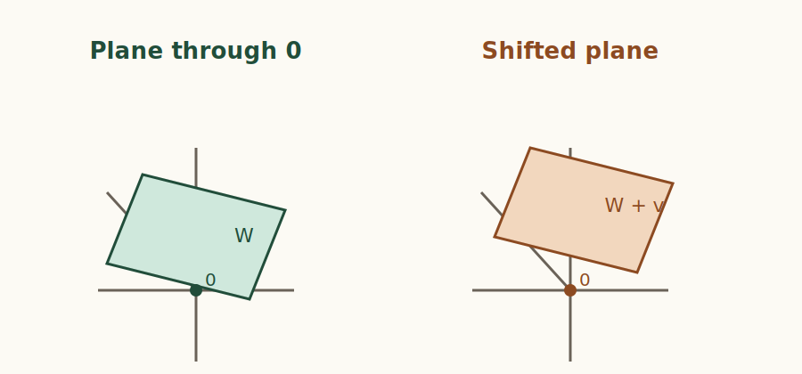
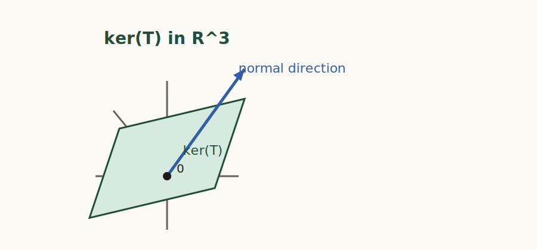
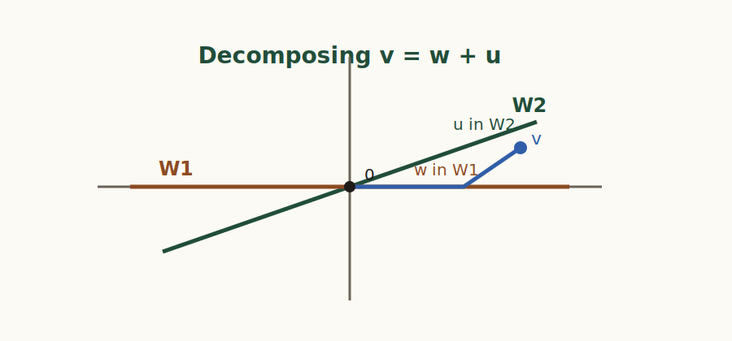
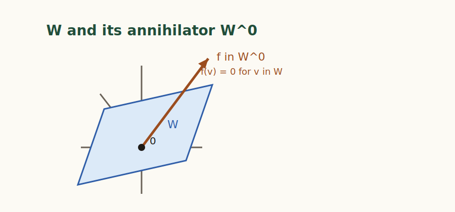

# 안내

이 문서는 김도형 교수님의 웹 강의노트 *추상선형대수학: 벡터공간과 대수학의 원리* 중 `1.1`부터 `2.3`까지를 읽기 좋은 단일 PDF로 재구성한 것이다.

- 편집 원칙: 원문 내용은 가능한 한 유지하고, 서식 정리와 `★ 중요`, `추가 문제`, `Challenge Problem`만 덧붙였다.
- 포함 범위: `1.1`, `1.2`, `1.3`, `1.4`, `2.1`, `2.2`, `2.3`
- 원문 출처: <https://dohyeong-kim.github.io/abstract-linear-algebra/frontmatter.html>
- Challenge Problem 참고: <https://anandinstitute.org/pdf/lenearal.pdf>
- 저작권 및 이용허락: © 2026 김도형, CC BY-SA 4.0  
  국문 안내: <https://creativecommons.org/licenses/by-sa/4.0/deed.ko/>  
  영문 안내: <https://creativecommons.org/licenses/by-sa/4.0/>

## 표시

- `★ 중요`: 시험 대비나 다음 절 연결상 특히 다시 풀어볼 만한 원문 연습문제
- `추가 문제`: 원문 본문을 바꾸지 않고, 복습용으로 덧붙인 문제
- `Challenge Problem`: `lenearal.pdf`의 문제를 수정 없이 그대로 옮긴 문제

## 원문 링크

| 절 | 링크 |
| --- | --- |
| 1.1 | <https://dohyeong-kim.github.io/abstract-linear-algebra/01-01-vector-spaces.html> |
| 1.2 | <https://dohyeong-kim.github.io/abstract-linear-algebra/01-02-basis.html> |
| 1.3 | <https://dohyeong-kim.github.io/abstract-linear-algebra/01-03-linear-transformation.html> |
| 1.4 | <https://dohyeong-kim.github.io/abstract-linear-algebra/01-04-quotients-cokernel.html> |
| 2.1 | <https://dohyeong-kim.github.io/abstract-linear-algebra/02-01-isomorphisms.html> |
| 2.2 | <https://dohyeong-kim.github.io/abstract-linear-algebra/02-02-isomorphism-theorems.html> |
| 2.3 | <https://dohyeong-kim.github.io/abstract-linear-algebra/02-03-product-projection-dual.html> |

  
벡터공간과 부분공간

  
→

  
기저와 차원

  
→

  
선형변환

  
→

  
몫공간

  
→

  
동형정리

  
→

  
사영과 쌍대성

# 1.1 벡터공간, 부분공간, 선형결합

## 소절 1.1.1 벡터공간

벡터공간의 정의는 벡터의 덧셈과 스칼라곱의 개념을 추상화한 결과입니다.
이는 두 단계로 진행되며, 우선 스칼라의 개념을 추상화하는 대수적 개념인
체

¹

부록의 Section A.1 참조

를 도입하고, 그 다음으로 벡터의 개념을 추상화하는 벡터공간의 정의로
이어집니다. 체의 개념이나 벡터의 덧셈은 이항연산의 특수한 경우입니다.
한편, 스칼라 곱셈에서는 스칼라와 그것이 곱해지는 대상이 다른 집합에서
택해진다는 점에서 통상의 이항연산과 다릅니다.

### 정의 1.1.1.

\(\mathbb{F}\)를 체라고 합시다.

체:field

집합 \(V\)에 다음 두 가지 연산, 즉 덧셈(\(+\colon V \times V \to V\))과
스칼라곱(\(\cdot: \mathbb{F} \times V \to V\))이 주어져 있을 때, 두
연산이 임의의 \(u, v, w \in V\)와 \(a, b \in \mathbb{F}\)에 대해 다음의
8가지 공리를 만족합니다. 이때 \(V\)를 \(\mathbb{F}\) 위의 벡터공간이라고
부릅니다.

1.  덧셈의 교환법칙: \(u + v = v + u\)

2.  덧셈의 결합법칙: \((u + v) + w = u + (v + w)\)

3.  덧셈에 대한 항등원: \(V\) 내에 영벡터(Zero vector)라 불리는 원소
\(\mathbf{0}\)이 존재하여, 모든 \(v \in V\)에 대해 \(v + \mathbf{0}
= v\)를 만족한다.

4.  덧셈에 대한 역원: 각 \(v \in V\)에 대해 \(v + (-v) = \mathbf{0}\)을
만족하는 \(-v \in V\)가 존재한다.

5.  스칼라 곱셈의 결합법칙: \(a(bv) = (ab)v\)

6.  스칼라 덧셈에 대한 분배법칙: \((a + b)v = av + bv\)

7.  벡터 덧셈에 대한 분배법칙: \(a(u + v) = au + av\)

8.  스칼라 곱셈에 대한 항등원: 체 \(\mathbb{F}\)의 곱셈 항등원 \(1\)에
대하여 \(1 \cdot v = v\)이다.

### 예시 1.1.2. 벡터 공간의 예시.

벡터 공간의 예시로는 다음과 같은 것들이 있습니다.

1.  유클리드 공간 \(\mathbb{F}^n\text{:}\) 체 \(\mathbb{F}\)의 원소들로
이루어진 \(n\)-튜플의 집합은 성분별 덧셈과 스칼라 곱셈에 대해 벡터
공간을 이룹니다.

2.  다항식 공간 \(\mathbb{F}[x]\text{:}\) \(\mathbb{F}\)에 계수를 갖는
모든 다항식의 집합은 다항식의 덧셈과 상수의 곱에 대해 벡터 공간을
이룹니다.

3.  함수 공간: 모든 \(\mathbb{R}\)에서 \(\mathbb{R}\)로 가는 함수의
집합은 실수체 위의 벡터 공간입니다. 함수 덧셈과 스칼라 곱셈은 각각
점별로 정의됩니다.

### 명제 1.1.3. 기본 대수적 성질.

\(V\)가 체 \(\mathbb{F}\) 위의 벡터 공간일 때, 임의의 \(v \in V\)와 \(c
\in \mathbb{F}\)에 대하여 다음이 성립한다:

1.  \(0 \cdot v = \mathbf{0}\) (여기서 좌변의 \(0\)은 체의 영원소,
우변의 \(\mathbf{0}\)은 벡터 공간의 영벡터이다)

2.  \(\displaystyle c \cdot \mathbf{0} = \mathbf{0}\)

3.  \(\displaystyle (-1)v = -v\)

**증명.**

정의 1.1.1에 의지하여 증명해야 합니다. 벡터 공간의 공리 6(스칼라 덧셈에
대한 분배법칙)에 의해, \(0 \cdot v = (0 + 0) \cdot v = 0 \cdot v + 0
\cdot v\)가 성립합니다. 공리 4에 의해 \(0 \cdot v\)의 덧셈에 대한 역원
\(-(0 \cdot v)\)가 존재하므로, 이를 양변에 더하면 \(\mathbf{0} = 0 \cdot
v + \mathbf{0} = 0 \cdot v\)가 됩니다.

공리 7에 의해 \(c \cdot \mathbf{0} = c \cdot (\mathbf{0} + \mathbf{0}) =
c \cdot \mathbf{0} + c \cdot \mathbf{0}\)입니다. 양변에 \(-(c \cdot
\mathbf{0})\)을 더하면 \(\mathbf{0} = c \cdot \mathbf{0}\)이 성립합니다.

공리 6과 위 1번의 결과에 의해, \(v + (-1)v = 1 \cdot v + (-1)v = (1 +
(-1))v = 0 \cdot v = \mathbf{0}\)입니다. 벡터의 덧셈 역원은 유일하므로
\((-1)v = -v\)입니다.

## 소절 1.1.2 부분공간

벡터 공간 안에는 그 자체로 또다시 벡터 공간의 구조를 갖춘 부분집합들이
존재합니다. 이를 부분공간이라 합니다.

### 정의 1.1.4. 부분공간.

<figure class="challenge-figure">

<figcaption>A plane through the origin can be a subspace; translating the same plane away from the origin usually breaks the subspace condition.</figcaption>
</figure>

체 \(\mathbb{F}\) 위의 벡터 공간 \(V\)의 부분집합 \(W\)가 주어졌을 때,
\(W\)가 \(V\)에 정의된 동일한 덧셈과 스칼라 곱셈 연산에 대하여 그 자체로
체 \(\mathbb{F}\) 위의 벡터 공간을 이룬면, \(W\)를 \(V\)의
부분공간이라고 부릅니다.

부분공간:subspace

### 예시 1.1.5. 자명한 부분공간.

임의의 벡터 공간 \(V\)에 대하여, 영벡터만을 포함하는 집합
\(\{\mathbf{0}\}\)과 전체 공간 \(V\) 자신은 항상 \(V\)의 부분공간입니다.
이를 자명한 부분공간이라

²

자명한 부분공간:trivial subspaces

부릅니다.

부분공간인지 확인하기 위해 8개의 공리를 모두 검증할 필요는 없습니다.
결합법칙이나 교환법칙 등은 부분집합에서도 당연히 유전되므로, 연산에 대해
닫혀 있는지만 검증하면 충분합니다.

### 정리 1.1.6. 부분공간 판정법.

\(V\)의 공집합이 아닌 부분집합 \(W\)가 \(V\)의 부분공간일 필요충분조건은
다음 두 가지 닫힘 성질을 만족하는 것입니다.

1.  덧셈에 대한 닫힘: 임의의 \(u, w \in W\)에 대하여 \(u + w \in
W\)입니다.

2.  스칼라 곱셈에 대한 닫힘: 임의의 \(c \in \mathbb{F}\)와 \(w \in W\)에
대하여 \(cw \in W\)입니다.

**증명.**

(\(\Rightarrow\)) \(W\)가 부분공간이라면 그 자체로 벡터 공간이므로
정의에 의해 두 연산에 대해 닫혀 있습니다.

(\(\Leftarrow\)) 덧셈과 스칼라 곱셈에 대해 닫혀 있다고 가정합시다.
\(V\)의 공리

³

정의 1.1.1

1, 2, 5, 6, 7, 8은 연산의 성질이므로 \(W\)의 원소들에 대해서도 자명하게
성립합니다. \(W\)는 공집합이 아니므로 최소한 하나의 원소 \(w \in W\)가
존재합니다. 스칼라 곱셈에 대해 닫혀 있으므로 체의 영원소 \(0\)에 대하여
\(0 \cdot w = \mathbf{0} \in W\)입니다. 즉 항등원이 존재합니다. 또한
임의의 \(w \in W\)에 대하여 스칼라 \(-1\)을 곱한 \((-1)w = -w \in
W\)이므로 역원도 존재합니다. 따라서 \(W\)는 벡터 공간의 8가지 공리를
모두 만족하므로 부분공간입니다.

부분공간 판정법은 벡터 공간의 부분집합이 부분공간인지 확인하는 데 매우
유용한 도구입니다. 예를 들어, 함수 공간에서 우함수들의 집합이 부분공간을
이루는지 확인할 때 이 판정법을 사용할 수 있습니다.

### 보조설명 1.1.7. 공집합이 아님 조건.

정리 1.1.6의 조건, 즉 \(W\)가 공집합이 아니라는 것을 필수적으로 확인해야
합니다. \(W\)가 공집합이라면, \(W\)는 벡터 공간의 정의에 따라 항등원과
역원이 존재하지 않으므로 부분공간이 될 수 없으나, 덧셈과 스칼라 곱셈에
대해 닫혀 있는 것은 자명하게 성립하기 때문입니다.

보통의 경우, 부분공간으로 예상되는 집합이 영벡터를 포함하는지 확인하여
공집합이 아님을 보이는 것이 가장 간단한 방법입니다.

### 예시 1.1.8. 우함수 공간에 부분공간 판정법 적용하기.

### 정의 1.1.9. 함수 공간과 우함수.

\(V = \mathcal{F}(\mathbb{R}, \mathbb{R})\)을 실수 집합
\(\mathbb{R}\)에서 \(\mathbb{R}\)로 가는 모든 함수들의 벡터 공간이라
하자 (이 공간에서 덧셈은 \((f+g)(x) = f(x) + g(x)\text{,}\) 스칼라
곱셈은 \((cf)(x) = c f(x)\)로 정의된다).함수 \(f \in V\)가 모든 실수 \(x
\in \mathbb{R}\)에 대하여 다음 조건을 만족할 때, \(f\)를 우함수

우함수:even function, 짝함수라고도 부름

라고 한다.

\begin{gather*} f(-x) = f(x) \end{gather*}

다음 명제를 생각해봅시다:

모든 실수에서 실수로 가는 함수의 벡터공간 \(V = \mathcal{F}(\mathbb{R},
\mathbb{R})\)의 부분집합 \(W\)를 모든 우함수들의 집합이라고 하자. 이때
\(W\)는 \(V\)의 부분공간이다.

위 명제를 증명하기 위해 아래와 같이 부분공간 판정법을 활용할 수
있습니다.

공집합이 아님:영벡터를 포함하면 공집합이 아님을 상기하자.함수 공간
\(V\)의 영벡터는 모든 \(x\)에 대해 함숫값이 \(0\)인 영함수
\(\mathbf{0}(x) = 0\)이다.임의의 실수 \(x\)에 대하여 \(\mathbf{0}(-x) =
0 = \mathbf{0}(x)\)가 성립한다.따라서 영함수는 우함수의 정의를
만족하므로 \(\mathbf{0} \in W\)이다.

덧셈에 대한 닫힘:\(W\)에 속하는 임의의 두 함수 \(f, g\)를 택하자. 정의에
의해 모든 \(x\)에 대하여 \(f(-x) = f(x)\)이고 \(g(-x) = g(x)\)이다. 두
함수의 합 \(f+g\)에 대하여 \(x\) 대신 \(-x\)를 대입하여 계산하면 다음과
같다.

\begin{align*} (f+g)(-x) & = f(-x) + g(-x)\\ & = f(x) + g(x)\\
& = (f+g)(x) \end{align*}

따라서 \(f+g\) 역시 우함수의 정의를 만족하므로 \((f+g) \in W\)이다.

스칼라 곱셈에 대한 닫힘:임의의 스칼라 \(c \in \mathbb{R}\)와 \(W\)에
속하는 함수 \(f\)를 택하자. \(f(-x) = f(x)\)이다. 스칼라 배 함수
\(cf\)에 대하여 \(-x\)를 대입하면 다음과 같다.

\begin{align*} (cf)(-x) & = c \cdot f(-x)\\ & = c \cdot f(x)\\
&= (cf)(x) \end{align*}

따라서 \(cf\) 역시 우함수의 정의를 만족하므로 \((cf) \in W\)이다.

세 가지 조건이 모두 충족되었으므로, 정리 1.1.6에 따르면 우함수들의 집합
\(W\)는 \(V\)의 부분공간이다.

## 소절 1.1.3 선형결합

### 정의 1.1.10. 선형결합.

체 \(\mathbb{F}\) 위의 벡터 공간 \(V\)와 부분집합 \(S \subseteq V\)를
생각하자. \(S\)에 속하는 유한 개의 벡터 \(v_1, v_2, \dots, v_k\)와 체
\(\mathbb{F}\)의 스칼라 \(c_1, c_2, \dots, c_k\)에 대하여, 다음 형태의
합으로 표현되는 \(V\)의 원소 \(v\)를 \(S\)에 속한 벡터들의
선형결합이라고 한다.

선형결합:linear combination

\begin{gather*} v = c_1 v_1 + c_2 v_2 + \dots + c_k v_k = \sum_{i=1}^{k}
c_i v_i \end{gather*}

### 보조설명 1.1.11. 선형결합에서 \(S\)가 공집합인 경우.

\(S\)가 공집합인 경우, 선형결합의 정의에 따르면 \(v = \sum_{i=1}^{0} c_i
v_i\)이 됩니다. 이때 합의 범위가 공집합이므로, 관례에 따라 이 합은 벡터
공간 \(V\)의 영벡터 \(\mathbf{0}\)로 정의됩니다. 따라서 \(S\)가 공집합인
경우에도 선형결합의 개념은 여전히 유효하며, 유일한 선형결합은
영벡터입니다.

### 보조설명 1.1.12. 선형결합에서 \(S\)가 무한집합인 경우.

\(S\)가 무한집합인 경우에도 선형결합의 정의는 여전히 유효합니다. 다만,
선형결합을 구성할 때는 항상 유한 개의 벡터와 스칼라만을 사용해야 한다는
점에 유의해야 합니다. 수렴성을 동반하는 무한합 개념과 혼동하지 않도록
주의해야 합니다. 선형대수학에서는 일반적으로 무한합을 다루지 않으므로,
선형결합은 항상 유한한 형태로 표현된다고 생각하는 것이 좋습니다.

어떤 집합의 선형결합들을 모두 모아놓은 집합을 생각할 수 있으며, 이는
선형대수학에서 가장 중요한 대상 중 하나입니다.

### 정의 1.1.13. 스팬, 생성.

벡터 공간 \(V\)의 부분집합 \(S\)에 대하여, \(S\)의 원소들로 만들 수 있는
모든 가능한 선형결합들의 집합을 \(S\)의 스팬이라 하고
\(\operatorname{span}(S)\)로 표기한다.

스팬:span, 생성:generate

수학적 관례에 따라 공집합의 스팬은 영벡터만을 포함하는 집합으로
정의한다. 즉, \(\operatorname{span}(\emptyset) = \{ \mathbf{0} \}\)
이다.

### 예시 1.1.14. 스팬의 예.

\(\mathbb{F}^2\)에서 \(S = \{(1, 1)\}\)이라고 하자.
\(\operatorname{span}(S)\)는 모든 스칼라 \(c \in \mathbb{F}\)에 대해
\(c(1, 1) = (c, c)\) 형태의 벡터들의 집합입니다. 기하학적으로 이는
원점을 지나고 기울기가 1인 직선을 나타냅니다.

### 예시 1.1.15. 대각행렬 공간에서의 스팬.

행렬 공간 \(M_{2 \times 2}(\mathbb{F})\)에서 집합 \(S = \left\{
\begin{pmatrix} 1 & 0 \\ 0 & 0 \end{pmatrix}, \begin{pmatrix} 0
& 0 \\ 0 & 1 \end{pmatrix} \right\}\)이 주어졌을 때,
\(\operatorname{span}(S)\)는 임의의 스칼라 \(a, b\)에 대하여
\(\begin{pmatrix} a & 0 \\ 0 & b \end{pmatrix}\) 형태를 띠는 모든
대각행렬들의 집합이 된다.

위에서 살펴본 예시는 스팬의 결과가 항상 부분공간이 될 수 있음을
시사합니다. 실제로, 스팬의 결과는 언제나 부분공간입니다.

### 명제 1.1.16. 스팬은 부분공간이다.

\(V\)가 체 \(\mathbb{F}\) 위의 벡터공간이고 \(S \subseteq V\)가 임의의
부분집합일 때, \(\operatorname{span}(S)\)는 \(V\)의 부분공간이다.

**증명.**

정리 1.1.6의 부분공간 판정법을 사용하여 증명합니다.

공집합이 아님: \(\operatorname{span}(\emptyset) = \{\mathbf{0}\}\)이므로
임의의 \(S\)에 대하여 \(\operatorname{span}(S)\)는 공집합이 아닙니다.

덧셈에 대한 닫힘: 임의의 \(u, v \in \operatorname{span}(S)\)를 택합시다.
정의에 의해 다음과 같이 나타낼 수 있습니다.

\begin{gather*} u = \sum_{i=1}^{m} a_i s_i, \quad v = \sum_{j=1}^{n} b_j
t_j \end{gather*}

여기서 \(s_i, t_j \in S\)이고 \(a_i, b_j \in \mathbb{F}\)입니다. 따라서
\(u + v = \sum_{i=1}^{m} a_i s_i + \sum_{j=1}^{n} b_j t_j\)는 \(S\)의
벡터들의 선형결합이므로 \(u + v \in \operatorname{span}(S)\)입니다.

스칼라 곱셈에 대한 닫힘: 임의의 스칼라 \(c \in \mathbb{F}\)와 \(v \in
\operatorname{span}(S)\)를 택합시다. \(v = \sum_{i=1}^{k} d_i s_i\)이면
다음이 성립합니다.

\begin{gather*} cv = c\sum_{i=1}^{k} d_i s_i = \sum_{i=1}^{k} (cd_i) s_i
\end{gather*}

여기서 \(cd_i \in \mathbb{F}\)이고 \(s_i \in S\)이므로, \(cv\)는 \(S\)의
벡터들의 선형결합입니다. 따라서 \(cv \in \operatorname{span}(S)\)입니다.

부분공간 판정법의 세 가지 조건이 모두 만족되므로,
\(\operatorname{span}(S)\)는 \(V\)의 부분공간입니다.

## 연습문제 1.1.4 연습문제

### 1. 개수 세기:유한체 위의 벡터 공간.

유한체 \(\mathbb{Z}/2\mathbb{Z}\) (즉, 원소가 \(\overline{0},
\overline{1}\)뿐인 체)를 생각하자. 이 체 위의 3차원 벡터 공간
\((\mathbb{Z}/2\mathbb{Z})^3\)의 원소의 총 개수는 몇 개인가?

### 2. 제1사분면이 부분공간인가?

유클리드 공간 \(\mathbb{R}^2\)에서 제1사분면(경계선 포함)의 집합 \(W =
\{(x, y) \in \mathbb{R}^2 \mid x \ge 0, y \ge 0\}\)이 주어졌다. \(W\)가
\(\mathbb{R}^2\)의 부분공간인지 판별하고 그 이유를 설명하시오.

### 3. 스팬과 선형종속.

임의의 벡터 공간 \(V\)와 \(\mathbf{0}\)이 아닌 벡터 \(v \in V\)가
주어졌을 때, 두 집합 \(\operatorname{span}(\{v\})\)와
\(\operatorname{span}(\{v, 2v\})\)가 서로 동일한 집합임을 보이시오.

### ★ 중요 4. 부분공간의 교집합.

체 \(\mathbb{F}\) 위의 벡터 공간 \(V\)의 임의의 두 부분공간 \(W_1,
W_2\)에 대하여, 그들의 교집합 \(W_1 \cap W_2\) 역시 \(V\)의 부분공간이
됨을 증명하시오.

### 5. 기함수 공간이 부분공간임을 보이기.

### 정의 1.1.17. 기함수.

기함수-우함수

함수 \(f \in V\)가 모든 실수 \(x \in \mathbb{R}\)에 대하여 다음 조건을
만족할 때, \(f\)를 기함수

기함수:odd function, 홀함수라고도 부름

라고 한다.

\begin{gather*} f(-x) = -f(x) \end{gather*}

\(V\)가 모든 실함수 \(f: \mathbb{R} \to \mathbb{R}\)의 공간이라 하자.
기함수들의 집합이 \(V\)의 부분공간임을 증명하시오.

### ★ 중요 6. 부분공간의 합.

임의의 두 부분공간 \(W_1, W_2\)에 대하여, 두 부분공간의 합 \(W_1 + W_2 =
\{w_1 + w_2 \mid w_1 \in W_1, w_2 \in W_2\}\)를 정의하자. 이 합공간이
\(W_1\)과 \(W_2\)를 모두 포함하는 \(V\)의 가장 작은 부분공간임을
증명하시오.

### 7. 행렬의 중심화기

중심화기:centralizer

.

### 정의 1.1.18. 중심화기.

\(V = M_{n \times n}(\mathbb{F})\)를 체 \(\mathbb{F}\) 위의 \(n \times
n\) 행렬들의 벡터 공간이라고 합니다. 고정된 행렬 \(M \in V\)에 대하여,
\(M\)과 교환 법칙이 성립하는 모든 행렬들의 집합을 \(M\)의 중심화기라고
부릅니다. 그리고 \(C(M)\)으로 표기합니다. 즉,

\begin{gather*} C(M) = \{ A \in V \mid AM = MA \} \end{gather*}

입니다.

다음을 보이시오: 임의의 고정된 행렬 \(M \in M_{n \times
n}(\mathbb{F})\)에 대하여, \(C(M)\)은 \(M_{n \times n}(\mathbb{F})\)의
부분공간이다.

**정답.**

부분공간 판정법의 세 가지 조건을 만족하는지 확인합니다.

영벡터의 포함: \(V\)의 영벡터는 \(n \times n\) 영행렬
\(\mathbf{0}\)입니다. 임의의 행렬 \(M\)에 대하여 \(\mathbf{0}M =
\mathbf{0}\) 이고 \(M\mathbf{0} = \mathbf{0}\) 이므로 \(\mathbf{0}M =
M\mathbf{0}\) 이 성립합니다. 따라서 \(\mathbf{0} \in C(M)\) 입니다.

덧셈에 대한 닫힘: 임의의 \(A, B \in C(M)\)을 택하면, 정의에 의해 \(AM =
MA\) 이고 \(BM = MB\) 입니다. 행렬 곱셈의 분배법칙을 적용하면 다음이
성립합니다.

\begin{gather*} \end{gather*}

따라서 \((A + B) \in C(M)\) 이므로 덧셈에 대해 닫혀 있습니다.

스칼라 곱셈에 대한 닫힘: 임의의 스칼라 \(c \in \mathbb{F}\)와 \(A \in
C(M)\)을 택하면 정의에 의해 \(AM = MA\) 입니다. 스칼라 곱셈의 성질을
적용하면 다음이 성립합니다.

\begin{gather*} \end{gather*}

따라서 \(cA \in C(M)\) 이므로 스칼라 곱셈에 대해 닫혀 있습니다.

부분공간 판정법의 세 가지 조건이 모두 충족되었으므로, \(C(M)\)은 \(V\)의
부분공간입니다.

### 8. 다항식 공간에서의 스팬.

차수 2차 이하인 모든 다항식으로 구성된 벡터공간 \(\mathbb{R}[x]_{\le
2}\)에서 집합 \(S = \{x^2 + 1, x\}\)가 주어졌다. 다항식 \(p(x) = 2x^2 +
3x + 2\)는 \(\operatorname{span}(S)\)에 속하는가?

### 9. 두 진부분공간의 합집합.

벡터공간 \(V\)가 두 개의 부분공간의 합집합, 즉 \(V = W_1 \cup W_2\)이라
하자. 이때 \(W_1\) 또는 \(W_2\)가 자명한 부분공간임을

⁴

예시 1.1.5

보이시오.

### ★ 중요 10. 스팬과 교집합.

임의의 벡터 공간 \(V\)와 \(V\)의 두 부분집합 \(S_1, S_2\)에 대하여 다음
물음에 답하시오.

a.  \(\operatorname{span}(S_1 \cap S_2) \subseteq
\operatorname{span}(S_1) \cap \operatorname{span}(S_2)\)가 항상
성립함을 증명하시오.

b.  위의 포함 관계에서 등호가 성립하지 않는, 즉
\(\operatorname{span}(S_1 \cap S_2) \neq \operatorname{span}(S_1)
\cap \operatorname{span}(S_2)\)인 구체적인 벡터 공간 \(V\)와
부분집합 \(S_1, S_2\)의 반례를 제시하고 그 이유를 엄밀하게
설명하시오.

### 11. 표수가 2인 체와 우함수, 기함수.

### 정의 1.1.19. 표수가 2인 체.

체 \(\mathbb{F}\)의 곱셈에 대한 항등원 \(1\)에 대하여 \(1+1=0\)이 성립할
때, \(\mathbb{F}\)를

표수:characteristic

표수가 2인 체라고 한다.

⁵

이러한 체에서는 임의의 원소 \(a \in \mathbb{F}\)에 대하여 \(a+a=0\)이
성립하며, 이는 곧 덧셈에 대한 역원이 자기 자신(\(-a=a\))임을 의미한다.

임의의 체 \(\mathbb{F}\)와 그 위에서 정의된 함수들의 벡터 공간 \(V =
\mathcal{F}(\mathbb{F}, \mathbb{F})\)를 생각하자. \(V\)의 두 부분집합인
우함수 공간 \(W_e\)와 기함수 공간 \(W_o\)를 다음과 같이 정의한다.

\begin{align*} W_e & = \{ f \in V \mid \text{모든 } x \in
\mathbb{F}\text{에 대하여 } f(-x) = f(x) \}\\ W_o & = \{ f \in V \mid
\text{모든 } x \in \mathbb{F}\text{에 대하여 } f(-x) = -f(x) \}
\end{align*}

체 \(\mathbb{F}\)의 표수가 2일 필요충분조건이 \(W_e = W_o\)임을
증명하시오.

## 추가 문제

### 추가 문제 1

부분집합 $S_1, S_2 \subseteq V$에 대하여 $\operatorname{span}(S_1 \cup S_2) = \operatorname{span}(S_1) + \operatorname{span}(S_2)$임을 증명하시오.

## Challenge Problems

### Challenge Problem 1

*Source: lenearal.pdf, Section 1.3, Exercise 8, PDF p. 32 (printed p. 20)*

8. Determine whether the following sets are subspaces of $\mathbf{R}^3$ under the operations of addition and scalar multiplication defined on $\mathbf{R}^3$. Justify your answers.

(a) $W_1 = \{(a_1, a_2, a_3) \in \mathbf{R}^3 : a_1 = 3a_2 \text{ and } a_3 = -a_2\}$

(b) $W_2 = \{(a_1, a_2, a_3) \in \mathbf{R}^3 : a_1 = a_3 + 2\}$

(c) $W_3 = \{(a_1, a_2, a_3) \in \mathbf{R}^3 : 2a_1 - 7a_2 + a_3 = 0\}$

(d) $W_4 = \{(a_1, a_2, a_3) \in \mathbf{R}^3 : a_1 - 4a_2 - a_3 = 0\}$

(e) $W_5 = \{(a_1, a_2, a_3) \in \mathbf{R}^3 : a_1 + 2a_2 - 3a_3 = 1\}$

(f) $W_6 = \{(a_1, a_2, a_3) \in \mathbf{R}^3 : 5a_1^2 - 3a_2^2 + 6a_3^2 = 0\}$

### Challenge Problem 2

*Source: lenearal.pdf, Section 1.3, Exercise 9, PDF p. 32 (printed p. 20)*

9. Let $W_1$, $W_3$, and $W_4$ be as in Exercise 8. Describe $W_1 \cap W_3$, $W_1 \cap W_4$, and $W_3 \cap W_4$, and observe that each is a subspace of $\mathbf{R}^3$.

### Challenge Problem 3

*Source: lenearal.pdf, Section 1.6, Exercise 33, PDF p. 70 (printed p. 58)*

33. (a) Let $W_1$ and $W_2$ be subspaces of a vector space $V$ such that $V = W_1 \oplus W_2$. If $\beta_1$ and $\beta_2$ are bases for $W_1$ and $W_2$, respectively, show that $\beta_1 \cap \beta_2 = \varnothing$ and $\beta_1 \cup \beta_2$ is a basis for $V$.

(b) Conversely, let $\beta_1$ and $\beta_2$ be disjoint bases for subspaces $W_1$ and $W_2$, respectively, of a vector space $V$. Prove that if $\beta_1 \cup \beta_2$ is a basis for $V$, then $V = W_1 \oplus W_2$.

# 1.2 기저의 존재성과 차원

## 소절 1.2.1 기저의 존재성과 차원에 대한 소개

이전 장에서 우리는 벡터들의 집합이 주어졌을 때, 그들의 선형결합을 통해
공간 전체를 ’생성(Span)’하는 방법을 배웠습니다. 그러나 어떤 공간을
생성하는 집합에는 공간을 묘사하는 데 굳이 필요하지 않은 ’잉여 벡터’들이
포함되어 있을 수 있습니다. 공간의 구조를 가장 효율적이고 본질적으로
이해하기 위해서는 낭비 없이 공간을 생성하는 최소한의 골격이 필요합니다.
이를 위해 벡터들 사이에 중복성이 없다는 개념인 선형독립을 정의하고,

선형독립:linear Independence

공간을 생성하는 독립적인 집합인 기저가 임의의 벡터공간에 반드시 존재함을
엄밀하게 증명합니다.

더 나아가, 기저의 존재는 벡터공간의 차원

차원:dimension

이라는 중요한 개념으로 이어집니다. 차원은 기저에 속한 벡터의 수로 이해할
수 있으며, 이를 엄밀하게 정당화하기 위해서 집합론을 사용할 것입니다.

## 소절 1.2.2 기저의 정의와 존재

### 정의 1.2.1. 선형독립.

체 \(\mathbb{F}\) 위의 벡터 공간 \(V\)의 부분집합 \(S\)를 생각합니다.
유한 개의 서로 다른 벡터 \(v_1, v_2, \dots, v_n \in S\)와 스칼라 \(c_1,
c_2, \dots, c_n \in \mathbb{F}\)에 대하여 방정식

\begin{gather*} c_1 v_1 + c_2 v_2 + \dots + c_n v_n = \mathbf{0}
\end{gather*}

을 만족하는 유일한 해가 \(c_1 = c_2 = \dots = c_n = 0\)(자명한 해) 뿐일
때, 집합 \(S\)는 선형독립이라고 합니다.

선형독립:linearly independent

만약 적어도 하나가 0이 아닌 스칼라들 \(c_1, \dots, c_n\)이 존재하여 위
방정식을 만족시킨다면, 집합 \(S\)는 선형종속이라고 합니다.

선형종속:linearly dependent

관습적으로 공집합은 선형 독립으로 간주합니다.

### 정의 1.2.2. 기저.

<figure class="cat-meme cat-meme-basis">

하나 빼도 <code>span</code>이 그대로면, 그 벡터는 basis가 아니다.

<code>already in span(others)</code> = 귀엽지만 새 방향은 못 준다

<figcaption>기저의 묘한 웃음 포인트는 “많이 모으기”가 아니라 “군식구를 끝까지 못 참기”에 있다. Photo: Eli Duke/Wikimedia Commons (CC BY-SA 2.0).</figcaption>
</figure>

기저:basis

벡터 공간 \(V\)의 부분집합 \(\beta\)가 다음 두 가지 조건을 모두 만족할
때, \(\beta\)를 \(V\)의 기저라고 합니다.

1.  \(\beta\)는 선형 독립이다.

2.  \(\operatorname{span}(\beta) = V\)이다.

### 예시 1.2.3. \(\mathbb{F}^n\)의 기저.

튜플:tuple:순서쌍

체 \(\mathbb{F}\) 위의 \(n\)-튜플들의 공간 \(\mathbb{F}^n\)에서 집합
\(\beta = \{e_1, e_2, \dots, e_n\}\)는 기저입니다. 여기서 \(e_i\)는
\(i\)번째 위치에 1이 있고 나머지 위치에는 0이 있는 벡터입니다. 이들은
\(\mathbb{F}^n\)을 생성하며, 그 선형결합이 영벡터가 되기 위한 유일한
조건은 모든 계수가 0이 되는 것뿐이므로 선형 독립입니다. 이를 표준 기저

표준 기저:standard basis

라 부릅니다.

### 예시 1.2.4. 다항식 공간의 기저.

다항식 공간 \(\mathbb{F}[x]_{\le n}\) (차수가 \(n\) 이하인 다항식들의
공간)에서 집합 \(\beta = \{1, x, x^2, \dots, x^n\}\)은 기저입니다.
이들은 공간을 생성하며, 영다항식이 되기 위한 유일한 조건은 모든 계수가
0이 되는 것뿐이므로 선형 독립입니다. 이를 표준 기저

표준 기저:standard basis

라 부릅니다.

¹

단항식 기저라고 부를 수도 있습니다.

### 정리 1.2.5. 기저의 존재성.

체 \(\mathbb{F}\) 위의 임의의 벡터 공간 \(V\)는 기저를 가진다.

**증명.**

벡터 공간 \(V\)의 모든 선형 독립인 부분집합들의 모임을
\(\mathcal{P}\)라고 정의합니다. 즉, \(\mathcal{P} = \{ S \subseteq V
\mid S \text{는 선형 독립이다} \}\) 입니다. 이 모임 \(\mathcal{P}\)에
집합의 포함 관계(\(\subseteq\))를 부여하면, \((\mathcal{P},
\subseteq)\)는 부분순서집합이 됩니다.

부분순서집합:partially ordered set

공집합 \(\emptyset\)은 관례에 따라 선형 독립이므로 \(\emptyset \in
\mathcal{P}\)이며, 따라서 \(\mathcal{P}\)는 공집합이 아닙니다.

초른의 보조정리를 적용하기 위해, \(\mathcal{P}\) 안의 임의의 사슬(Chain)
\(\mathcal{C}\)가 \(\mathcal{P}\) 안에서 상계(upper bound)를 가짐을
보여야 합니다. 사슬 \(\mathcal{C}\)에 속하는 모든 선형 독립 집합들의
합집합을 \(U\)라고 정의합니다.

\begin{gather*} U = \bigcup_{S \in \mathcal{C}} S \end{gather*}

이 합집합 \(U\)가 \(\mathcal{P}\)의 원소, 즉 \(U\) 역시 선형 독립임을
증명합니다.

선형 독립성을 확인하기 위해, \(U\)에서 임의의 유한 개의 벡터 \(v_1, v_2,
\dots, v_n\)을 택하고 이들의 선형결합이 영벡터가 된다고 가정합니다.

\begin{gather*} c_1 v_1 + c_2 v_2 + \dots + c_n v_n = \mathbf{0} \quad
(c_i \in \mathbb{F}) \end{gather*}

\(U\)의 정의에 의해, 각각의 \(v_i\)는 \(\mathcal{C}\)에 속하는 어떤 집합
\(S_i\)의 원소입니다. \(\mathcal{C}\)는 사슬이므로 임의의 두 원소는 포함
관계를 가집니다. 유한 개의 집합 \(S_1, S_2, \dots, S_n\) 중에서 포함
관계에 따라 가장 큰 집합을 \(S_k\)라고 하면, 모든 \(v_1, \dots, v_n\)은
\(S_k\)에 속하게 됩니다. 그런데 \(S_k \in \mathcal{C} \subseteq
\mathcal{P}\)이므로 \(S_k\)는 선형 독립입니다. 따라서 위 선형결합을
만족하는 스칼라는 오직 \(c_1 = c_2 = \dots = c_n = 0\) 뿐입니다. 이는
\(U\)에 속하는 임의의 유한 부분집합이 선형 독립임을 의미하므로, \(U\)
자체도 선형 독립입니다. 따라서 \(U \in \mathcal{P}\)입니다.

명백하게 모든 \(S \in \mathcal{C}\)에 대하여 \(S \subseteq U\)이므로,
\(U\)는 부분순서집합 \(\mathcal{P}\) 안에서 사슬 \(\mathcal{C}\)의
상계입니다. 임의의 사슬이 상계를 가지므로, 초른의 보조정리에 의해
\(\mathcal{P}\)는 적어도 하나의 극대원소(maximal element) \(B\)를
가집니다.

이제 이 극대 선형 독립 집합 \(B\)가 \(V\)를
생성함(\(\operatorname{span}(B) = V\))을 증명하여 기저임을 보입니다.
결론을 부정하여 \(\operatorname{span}(B) \neq V\)라고 가정합니다. 그러면
\(V\) 안에는 \(\operatorname{span}(B)\)에 속하지 않는 어떤 벡터 \(w\)가
존재합니다. 새로운 집합 \(B' = B \cup \{w\}\)를 생각합니다. \(w \notin
\operatorname{span}(B)\)이므로, 이 집합은 여전히 선형 독립입니다. (만약
종속이라면 \(w\)가 \(B\)의 선형결합으로 표현되어 모순이 발생하기
때문입니다). 따라서 \(B' \in \mathcal{P}\)입니다. 그런데 \(B \subsetneq
B'\)이므로, 이는 \(B\)가 극대원소라는 사실에 명백하게 모순됩니다.

이 모순은 \(\operatorname{span}(B) \neq V\)라는 가정에서 비롯되었으므로,
\(\operatorname{span}(B) = V\)이어야만 합니다. 결론적으로 집합 \(B\)는
선형 독립이며 공간 전체를 생성하므로 \(V\)의 기저입니다.

### 예시 1.2.6. 무한 차원 공간의 기저.

실수 계수 다항식들의 공간 \(\mathbb{R}[x]\)를 생각합니다. 이 공간의
원소인 다항식은 무한한 차수를 가질 수 있기 때문에 유한 생성 공간이
아닙니다. 이 공간의 기저는 \(B = \{1, x, x^2, x^3, \dots\}\) 입니다.
\(B\)는 무한 집합이지만, 무한 차원 공간에서의 선형결합 역시 반드시 ’유한
번의 합’으로 정의됨을 상기해야 합니다. 임의의 다항식은 정확히 유한
차수를 가지므로, \(B\)의 원소들 중 유한 개만을 사용하여 유일하게 표현될
수 있습니다.

### 예시 1.2.7. 하멜 기저.

실수 집합 \(\mathbb{R}\)을 유리수 체 \(\mathbb{Q}\) 위의 벡터 공간으로
취급할 수 있습니다. 정리 1.2.5에 따르면, 이 벡터 공간 \(\mathbb{R}\)
역시 \(\mathbb{Q}\) 상의 기저를 반드시 가집니다. 이를 특별히 하멜 기저

하멜 기저:Hamel basis

라고 부릅니다. 하멜 기저의 원소들을 \(b_\alpha\)라 하면, 임의의 실수
\(x\)는

\begin{gather*} x = q_1 b_{\alpha_1} + \dots + q_n b_{\alpha_n} \quad
(q_i \in \mathbb{Q}) \end{gather*}

형태로 유일하게 표현됩니다. 단, 여기서 \(n\)은 \(x\)에 따라 달라질 수
있습니다.

흥미롭게도, 초른의 보조정리는 존재성만을 보장할 뿐, 하멜 기저의 구체적인
원소들을 단 하나도 명시적으로 구성하는 방법을 알려주지 않습니다. 우리는
그것이 존재한다는 기이한 확신만을 가질 뿐입니다.

### 보조설명 1.2.8. 하멜 기저라는 용어가 도태된 이유.

하멜 기저는 우리가 정의한 기저 개념의 특수한 경우입니다. 따라서 하멜
기저라는 용어는 엄밀히 말해서 더 이상 필요하지 않습니다. 그러나
역사적으로는 하멜 기저가 존재한다는 사실이 벡터 공간 이론에서 중요한
이정표였기 때문에, 그 용어가 한동안 사용되었습니다. 한편, 우리가 다루지
않을 개념인 샤우더 기저(Schauder basis)와 이름을 쉽게 구별하기 위해서
하멜 기저라는 용어가 여전히 사용되는 경우도 있습니다. 결론적으로, 단순히
“기저”라고 부르는 것이 더 간결하고 현대적인 표현입니다.

## 소절 1.2.3 기저의 크기 불변성

본론인 기저의 크기 불변성을 다루기 전에 짚고 넘어갈 사실이 하나
있습니다.

### 명제 1.2.9. 유한 생성 공간의 선형독립 집합 크기 제한.

체 \(\mathbb{F}\) 위의 벡터 공간 \(V\)가 \(n\)개의 벡터로 생성된다고
가정하자. 즉, \(V = \operatorname{span}(\{v_1, v_2, \dots, v_n\})\)이다.
그러면 \(V\)의 임의의 선형 독립 부분집합 \(S\)는 최대 \(n\)개의 원소를
가진다. 즉, \(|S| \le n\)이다.

**증명.**

결론을 부정하여 \(|S| > n\)인 선형 독립 부분집합 \(S = \{w_1, w_2,
\dots, w_m\}\)이 존재한다고 가정합니다. 여기서 \(m > n\)입니다.

\(V = \operatorname{span}(\{v_1, v_2, \dots, v_n\})\)이므로, \(S\)의 각
원소 \(w_i\)는 다음과 같이 표현될 수 있습니다.

\begin{gather*} w_i = a_{i1} v_1 + a_{i2} v_2 + \dots + a_{in} v_n \quad
(a_{ij} \in \mathbb{F}) \end{gather*}

선형 독립 집합 \(S\)에서 임의의 유한 부분집합을 택하면, 그 선형결합이
영벡터가 되기 위한 유일한 조건은 모든 계수가 영이어야 한다는 것입니다.
특히 \(S\)에서 \(m\)개의 벡터 모두를 택하여,

\begin{gather*} c_1 w_1 + c_2 w_2 + \dots + c_m w_m = \mathbf{0}
\end{gather*}

이 방정식을 만족하려면 \(c_1 = c_2 = \dots = c_m = 0\)이어야 합니다.

위 식에 앞의 표현을 대입하면,

\begin{gather*} c_1 \sum_{j=1}^{n} a_{1j} v_j + c_2 \sum_{j=1}^{n}
a_{2j} v_j + \dots + c_m \sum_{j=1}^{n} a_{mj} v_j = \mathbf{0}
\end{gather*}

이를 재정렬하면,

\begin{gather*} \sum_{j=1}^{n} \left( \sum_{i=1}^{m} c_i a_{ij} \right)
v_j = \mathbf{0} \end{gather*}

\(\{v_1, v_2, \dots, v_n\}\)은 \(V\)를 생성하는 집합이므로, 위 방정식이
성립하려면 각 \(j = 1, 2, \dots, n\)에 대하여

\begin{gather*} \sum_{i=1}^{m} c_i a_{ij} = 0 \end{gather*}

이 성립하는 것으로 충분합니다.

이제 행렬 형태로 표현하면, \(m \times n\) 행렬 \(A = (a_{ij})\)에 대하여
벡터 \(\mathbf{c} = (c_1, c_2, \dots, c_m)^T\)가 동차 선형 방정식 \(A^T
\mathbf{c} = \mathbf{0}\)을 만족해야 합니다.

\(m > n\)이므로, 행렬 \(A^T\)는 \(n \times m\) 행렬이고, 행의 개수가
열의 개수보다 적습니다. 따라서 이 동차 선형 방정식계는 자명하지 않은
해를 반드시 가집니다. 즉, 모든 성분이 0이 아닌 벡터 \(\mathbf{c}\)가
존재하여 \(A^T \mathbf{c} = \mathbf{0}\)을 만족합니다.

그러나 이는 \(c_1 w_1 + c_2 w_2 + \dots + c_m w_m = \mathbf{0}\)을
만족하는 영이 아닌 계수들이 존재함을 의미하므로, \(S\)가 선형 종속이라는
모순이 발생합니다.

따라서 우리의 가정 \(|S| > n\)은 거짓이고, \(|S| \le n\)이 성립해야
합니다.

### 정리 1.2.10. 기저의 크기 불변성.

체 \(\mathbb{F}\) 위의 벡터 공간 \(V\)가 두 개의 기저 \(B_1\)과
\(B_2\)를 가지면, 두 기저의 기수는 같다. 즉, \(|B_1| = |B_2|\)이다.

**증명.**

두 기저 중 적어도 하나가 유한 집합인 경우와, 둘 다 무한 집합인 경우로
나누어 증명합니다.

경우 1: 두 기저 중 적어도 하나가 유한 집합인 경우

일반성을 잃지 않고 \(B_1\)이 유한 집합이라 가정하고 그 크기를 \(|B_1| =
n\)이라 하겠습니다. 기저는 공간 전체를 생성하므로 \(V =
\operatorname{span}(B_1)\)입니다.

\(n\)개의 원소로 생성되는 공간 내의 임의의 선형 독립 집합의 크기는
\(n\)을 초과할 수 없습니다. \(B_2\)는 선형 독립 집합이므로 \(|B_2| \le
n\)입니다. 따라서 \(B_2\) 역시 유한 집합입니다.

역으로 \(B_2\)가 \(V\)를 생성하고 \(B_1\)이 선형 독립 집합이라는 사실에
동일한 보조정리를 적용하면 \(|B_1| \le |B_2|\)가 성립합니다.

따라서 \(|B_1| \le |B_2|\) 이고 \(|B_2| \le |B_1|\) 이므로 \(|B_1| =
|B_2|\) 입니다.

경우 2: \(B_1\)과 \(B_2\)가 모두 무한 집합인 경우

각 \(v \in B_1\)에 대하여, \(v\)는 기저 \(B_2\)의 원소들의 유한
선형결합으로 유일하게 표현될 수 있습니다.

\begin{gather*} v = c_1 w_1 + c_2 w_2 + \dots + c_k w_k \quad (w_i \in
B_2, c_i \neq 0) \end{gather*}

이 선형결합에 실제로 참여하는 \(B_2\)의 원소들의 유한 집합을
\(S(v)\)라고 정의합니다. (즉, 위 식에서 \(S(v) = \{w_1, \dots,
w_k\}\)입니다.)

이제 이 유한 집합들의 모든 합집합을 \(S\)라고 하겠습니다.

\begin{gather*} S = \bigcup_{v \in B_1} S(v) \end{gather*}

정의에 의해 \(S \subseteq B_2\)입니다. 또한 \(B_1\)의 모든 원소는
\(S\)의 원소들의 선형결합으로 표현되므로 \(B_1 \subseteq
\operatorname{span}(S)\)입니다.

\(B_1\)이 기저이므로 \(V = \operatorname{span}(B_1) \subseteq
\operatorname{span}(\operatorname{span}(S)) = \operatorname{span}(S)\)가
성립합니다. 즉, \(S\)는 \(V\) 전체를 생성합니다.

그런데 \(B_2\)는 기저이므로 그 어떠한 진부분집합도 \(V\)를 생성할 수
없습니다. 따라서 부분집합 \(S\)는 반드시 \(B_2\) 전체와 같아야만 합니다.
(\(S = B_2\))

이제 기수의 연산을 적용합니다. \(B_2 = \bigcup_{v \in B_1} S(v)\)이고,
각각의 \(S(v)\)는 유한 집합(기수가 \(\aleph_0\) 미만)입니다. 무한 집합의
가산 합집합에 대한 집합론의 기본 성질에 의하여, \(B_2\)의 기수는 다음과
같이 제한됩니다.

\begin{gather*} |B_2| = \left| \bigcup_{v \in B_1} S(v) \right| \le
\sum_{v \in B_1} |S(v)| \le |B_1| \times \aleph_0 \end{gather*}

\(B_1\)이 무한 집합이므로, 알레프 수의 곱셈 규칙에 의해 \(|B_1| \times
\aleph_0 = |B_1|\)이 성립합니다.

결과적으로 \(|B_2| \le |B_1|\)이라는 기수 부등식을 얻습니다. 이는
\(B_2\)에서 \(B_1\)으로 향하는 단사 함수가 존재함을 의미합니다.

이제 \(B_1\)과 \(B_2\)의 역할을 완벽하게 뒤바꾸어 동일한 논리를
전개하겠습니다. \(B_2\)의 각 원소를 \(B_1\)의 유한 선형결합으로 나타내어
합집합을 구하면, 대칭성에 의해 \(|B_1| \le |B_2|\)라는 결과를 얻게
됩니다. 이는 \(B_1\)에서 \(B_2\)로 향하는 단사 함수 역시 존재함을
의미합니다.

양방향으로의 단사 함수가 모두 존재함(\(|B_1| \le |B_2|\) 이고 \(|B_2|
\le |B_1|\))을 확인하였으므로, 정리 A.2.15에 의하여 다음이 최종적으로
성립합니다.

\begin{gather*} |B_1| = |B_2| \end{gather*}

이로써 임의의 벡터 공간이 가지는 기저의 크기는 유일하게 결정됨이
증명되었습니다.

### 정의 1.2.11. 차원.

벡터 공간 \(V\)의 기저의 크기를 \(V\)의 차원이라고 하며, 이를
\(\dim(V)\)로 표기합니다.

### 예시 1.2.12. 차원의 예시.

체 \(\mathbb{F}\) 위의 벡터 공간 \(\mathbb{F}^n\)의 차원은 \(n\)입니다.
다항식 공간 \(\mathbb{F}[x]_{\le n}\)의 차원은 \(n+1\)입니다. 실수 집합
\(\mathbb{R}\)을 유리수 체 \(\mathbb{Q}\) 위의 벡터 공간으로 취급할 때,
그 차원은 무한입니다.

체 \(\mathbb{F}\)상의 벡터공간 \(V\)이 있을 때, \(\mathbb{F}\)를 \(V\)의
기저체라 합니다.

기저체:base field

기저체가 문맥상 명확한 경우 각종 기호나 문장에서 생략할 수 있으나,
생략이 곤란한 경우 명시하는 것이 좋습니다. 예를 들면, 기저체를 명시할
때에는 차원을 \(\dim_{\mathbb{F}}(V)\)로 표기합니다.

## 연습문제 1.2.4 연습문제

### 1. 선형독립 여부 판별.

유리수상의 벡터공간 \(\mathbb{Q}^2\)에서 두 벡터 \(v_1 = (2, 4)\)와
\(v_2 = (-3, -6)\)이 선형 독립인지 선형 종속인지 판별하시오.

### 2. 영벡터와 독립성.

영벡터 \(\mathbf{0}\)을 포함하는 벡터 공간 \(V\)의 임의의 부분집합
\(S\)는 항상 선형 종속임을 증명하시오.

### 3. 다항식과 함수의 선형독립.

다항식 공간 \(P_2(\mathbb{R})\)에서 집합 \(B = \{1, x, x^2\}\)이 기저가
되기 위한 두 가지 필수 조건(선형 독립성, 생성)을 직관적으로 확인하고
설명하시오. (단, 스칼라는 실수이다.) 그리고, 각 다항식이 나타내는 함수가
선형독립인지 확인하고 설명하시오.

### 4. 독립성의 유전.

벡터 공간 \(V\)의 집합 \(S\)가 선형 독립일 때, 공집합이 아닌 \(S\)의
임의의 부분집합 \(S'\) 역시 선형 독립임을 증명하시오.

### 5. 합과 차의 독립성.

체 \(\mathbb{F}\)(단, 표수가 2가 아님) 위의 벡터 공간 \(V\)에서 두 벡터
\(u, v\)가 선형 독립이면, \(u+v\)와 \(u-v\) 역시 선형 독립임을
증명하시오.

### ★ 중요 6. \(\mathbb{R}^3\)의 기저.

\(\mathbb{R}^3\) 공간에서 세 벡터 \(v_1 = (1, 1, 0), v_2 = (1, 0, 1),
v_3 = (0, 1, 1)\)로 이루어진 집합이 기저를 형성함을 엄밀하게 증명하시오.

### ★ 중요 7. \(\mathbb{R}^4\)의 기저 확장.

\(\mathbb{R}^4\) 공간에 주어진 선형 독립 집합 \(S = \{(1, 0, 1, 0), (0,
1, 1, 0)\}\)에 표준 기저의 원소들을 적절히 추가하여 \(\mathbb{R}^4\)의
전체 기저로 확장하시오.

### 8. 대각합이 0인 행렬의 기저.

대각합:trace

\(2 \times 2\) 실수 행렬 공간 \(M_{2 \times 2}(\mathbb{R})\)에서
대각합(trace)이 0인 행렬들의 부분공간 \(W\)를 생각하자. \(W\)의 기저를
하나 찾고, 그것이 기저의 조건을 모두 만족함을 증명하시오.

### 9. 두 원소 체 상의 제곱식.

두 원소 체 \(\mathbb{F}=\mathbb{Z}/2\mathbb{Z}\) 에서 두 단항식 \(x\)와
\(x^2\)이 나타내는 함수가 같음을 보이시오. 이로부터, 다항식 공간
\(P_n(\mathbb{F})\)의 차원은 \(n+1\)차원임에도 불구하고, 모든 다항함수의
공간 \(V=\mathcal F(F,F)\)는 2차원임을 보이시오.

### 10. 체 확장에 따른 차원 변화.

\(V\)를 복소수 체 \(\mathbb{C}\) 위에서 정의된 \(n\)차원 벡터 공간이라
하자. 이 동일한 공간 \(V\)를 실수 체 \(\mathbb{R}\) 위의 벡터 공간으로
간주할 때, 새로운 차원 \(\dim_{\mathbb{R}}(V)\)가 \(2n\)이 됨을
증명하시오.

### 11. 부분공간 사슬의 길이 제한.

체 \(\mathbb{F}\) 위의 벡터 공간 \(V\)의 차원이 \(\dim(V) = n\)일 때,
부분공간들의 순 증가열 \(\{\mathbf{0}\} \subsetneq W_1 \subsetneq W_2
\subsetneq \dots \subsetneq W_k \subseteq V\) 가 존재한다면 반드시 \(k
\le n\) 이어야 함을 증명하시오.

### ★ 중요 12. 선형독립 집합의 기저로의 확장.

벡터공간 \(V\)의 선형독립인 부분집합 \(S \subset V\)에 대하여, \(S\)를
포함하는 기저가 존재함을 보이시오.

### ★ 중요 13. 생성 집합으로부터 기저의 추출.

벡터공간 \(V\)에 포함된 집합 \(S\)가 \(V\)를 생성하면, \(S\)에 포함되는
\(V\)의 기저가 존재함을 보이시오.

## 추가 문제

### 추가 문제 1

$\dim(V)=n$인 유한차원 공간에서 $n$개의 벡터가 선형독립이면 기저이고, $n$개의 벡터가 $V$를 생성하면 기저임을 증명하시오.

## Challenge Problems

### Challenge Problem 1

*Source: lenearal.pdf, Section 1.7, Exercise 4, PDF p. 74 (printed p. 62)*

4. Let $W$ be a subspace of a (not necessarily finite-dimensional) vector space $V$. Prove that any basis for $W$ is a subset of a basis for $V$.

### Challenge Problem 2

*Source: lenearal.pdf, Section 1.7, Exercise 5, PDF p. 74 (printed p. 62)*

5. Prove the following infinite-dimensional version of Theorem 1.8 (p. 43): Let $\beta$ be a subset of an infinite-dimensional vector space $V$. Then $\beta$ is a basis for $V$ if and only if for each nonzero vector $v$ in $V$, there exist unique vectors $u_1, u_2, \ldots, u_n$ in $\beta$ and unique nonzero scalars $c_1, c_2, \ldots, c_n$ such that $v = c_1u_1 + c_2u_2 + \cdots + c_nu_n$.

### Challenge Problem 3

*Source: lenearal.pdf, Section 1.7, Exercise 6, PDF p. 74 (printed p. 62)*

6. Prove the following generalization of Theorem 1.9 (p. 44): Let $S_1$ and $S_2$ be subsets of a vector space $V$ such that $S_1 \subseteq S_2$. If $S_1$ is linearly independent and $S_2$ generates $V$, then there exists a basis $\beta$ for $V$ such that $S_1 \subseteq \beta \subseteq S_2$. Hint: Apply the maximal principle to the family of all linearly independent subsets of $S_2$ that contain $S_1$, and proceed as in the proof of Theorem 1.13.

### Challenge Problem 4

*Source: lenearal.pdf, Section 1.7, Exercise 7, PDF p. 74 (printed p. 62)*

7. Prove the following generalization of the replacement theorem. Let $\beta$ be a basis for a vector space $V$, and let $S$ be a linearly independent subset of $V$. There exists a subset $S_1$ of $\beta$ such that $S \cup S_1$ is a basis for $V$.

# 1.3 선형변환, 커널, 이미지

Section Lens

선형변환은 벡터를 어디로 보내는가보다, 어떤 방향을 죽이고 어떤 방향을 남기는가가 더 중요하다.

이 절에서 계속 봐야 할 대상은 <code>ker(T)</code>와 <code>im(T)</code>다. 하나는 정의역 안의 정보 손실이고, 다른 하나는 공역 안의 실제 도달 영역이다.

Map

\[
V \xrightarrow{T} W,\qquad
\ker(T) \subseteq V,\qquad
\operatorname{im}(T) \subseteq W
\]

뒤의 <code>1.4</code>에서는 \(V/\ker(T)\)를 만들고, <code>2.2</code>에서는 그것이 실제로 \(\operatorname{im}(T)\)와 같아짐을 본다.

지금까지 우리는 기저와 차원 등 단일한 벡터 공간 내부에 존재하는 대수적
구조를 탐구했습니다. 그러나 현대 추상대수학의 관점에서 어떤 수학적
대상의 본질을 진정으로 이해하기 위해서는, 그 대상 자체만을 들여다보는
것을 넘어 대상들 사이의 “구조를 보존하는 사상”을 연구해야 합니다.

¹

대상:object, 사상:morphism

### 예시 1.3.1. 구조 보존의 예: 성씨 보존 함수.

앞으로 배우게 될 덧셈이나 스칼라곱과 같은 구조 대신, 직관적 이해를 돕기
위하여 사람 간의 구조인 가계도를 생각해 봅시다. 모두가 예외없이 어머니의
성씨를 승계받는 극단적으로 단순한 사회 모형을 가정합시다.

²

각 사람은 유일한 성씨를 가지며, 모든 사람은 유일한 어머니를 갖는다는
가정을 하고 있습니다.

이 사회에서 주어진 사람 \(p\)를 그 사람의 어머니 \(m(p)\)로 대응시키는
함수 \(p\)를 생각해 봅시다. 이 함수는 \(p\)와 \(m(p)\)의 성씨가 같다는
성질을 만족합니다. (\(p\)는 어머니 \(m(p)\)의 성씨를 승계받음) 따라서,
이 함수 \(m\)은 “성씨 구조”를 보존하는 사상입니다.

위에서 살펴본 예시를 집합과 함수를 이용해 다시 표현해 보겠습니다.사람의
집합 \(X\)과 모든 가능한 성씨 집합 \(N\) 대하여, 사람의 성씨는 함수 \(f
\colon X\to N\)로 표현하고 모계 구조는위에서와 같이 함수 \(m \colon X
\to X\)로 표현합니다. 이 경우, 배경이 되는 집합은 \(X\)이며 이 집합에
추가로 주어진 함수 \(f\)를 구조라고 합니다. 종합하면, 주어진 수학적
대상은 \((X,f)\) 순서쌍이 됩니다. 이때, 어머니 대응 함수 \(p \colon X
\to X\)는 배경이 되는 집합 \(X\)에 정의된 함수로서 구조 \(f\)를
보존한다고 말합니다.

벡터공간의 경우 주어진 함수가 덧셈과 스칼라곱 구조를 보존하는 경우
선형변환이라고 부를 것입니다.

선형 변환:linear transformation

벡터 만큼이나 선형변환의 개념도 어디에나 있습니다. 선형변환은 기하학적인
회전과 대칭부터 미분방정식의 연산자에 이르기까지 수학 전반에 걸쳐
광범위하게 등장합니다.

## 소절 1.3.1 선형변환의 정의

### 정의 1.3.2. 선형 변환.

\(V\)와 \(W\)를 동일한 체 \(\mathbb{F}\) 위의 벡터 공간이라 합시다. 함수
\(T: V \to W\)가 임의의 벡터 \(u, v \in V\)와 스칼라 \(c \in
\mathbb{F}\)에 대하여 다음 두 조건을 모두 만족할 때, \(T\)를 \(V\)에서
\(W\)로 가는 선형변환이라고 합니다.

1.  덧셈의 보존: \(T(u + v) = T(u) + T(v)\)

2.  스칼라 곱셈의 보존: \(T(cu) = cT(u)\)

덧셈과 스칼라곱셈으로부터 얻어지는 선형결합 또한 보존될 것이라 예상할 수
있습니다.

### 명제 1.3.3.

임의의 선형변환 \(T:V\to W\)는 선형결합을 보존한다. 즉, 임의의 벡터
\(v_1, \ldots, v_n \in V\)와 스칼라 \(c_1, \ldots, c_n \in
\mathbb{F}\)에 대하여 다음이 성립한다: \(T(c_1 v_1 + \cdots + c_n v_n) =
c_1 T(v_1) + \cdots + c_n T(v_n)\text{.}\)

**증명.**

선형변환의 정의에 따라, \(T(c_1 v_1 + \cdots + c_n v_n)\)는 다음과 같이
계산할 수 있습니다.

\begin{align*} T(c_1 v_1 + \cdots + c_n v_n) &= T(c_1 v_1) + T(c_2
v_2 + \cdots + c_n v_n)\\ &= c_1 T(v_1) + T(c_2 v_2 + \cdots + c_n
v_n)\\ & \hspace{5pt} \vdots\\ &= c_1 T(v_1) + \cdots + c_n
T(v_n). \end{align*}

선형변환의 보편적 성질 중 하나는, 영벡터를 보존하는 것입니다.

### 명제 1.3.4.

\(T: V \to W\)가 선형 변환이면, 다음이 성립한다.

1.  \(T(\mathbf{0}_V) = \mathbf{0}_W\) (영벡터는 영벡터로 대응된다.)

2.  임의의 \(v \in V\)에 대하여 \(T(-v) = -T(v)\)이다.

**증명.**

먼저 영벡터의 보존을 살펴봅시다. 벡터 공간의 성질에 의해
\(\mathbf{0}_V + \mathbf{0}_V = \mathbf{0}_V\)입니다. 양변에 함수
\(T\)를 취하면 \(T(\mathbf{0}_V + \mathbf{0}_V) = T(\mathbf{0}_V)\)가
됩니다. \(T\)는 선형 변환이므로 덧셈을 분리할 수 있습니다.

\begin{equation*} T(\mathbf{0}_V) + T(\mathbf{0}_V) = T(\mathbf{0}_V)
\end{equation*}

공역 \(W\) 역시 벡터 공간이므로 덧셈에 대한 소거법칙이 성립합니다.
양변에 \(-T(\mathbf{0}_V)\)를 더하면 \(T(\mathbf{0}_V) =
\mathbf{0}_W\)를 얻습니다.

다음으로 덧셈에 대한 역원 보존 여부를 살펴봅시다. 선형 변환의 스칼라
곱셈 보존 성질에 \(c = -1\)을 대입하면 즉각적으로 다음 식이 성립합니다:
\(T(-v) = T((-1)v) = (-1)T(v) = -T(v)\text{.}\)

### 예시 1.3.5. 자명한 변환과 항등 변환.

임의의 벡터 공간 \(V, W\)에 대하여, 모든 \(v \in V\)를 \(W\)의 영벡터로
보내는 영 변환 \(T_0(v) = \mathbf{0}_W\)는 선형 변환입니다. 또한 \(V\)의
모든 원소를 자기 자신으로 보내는 항등 변환 \(I_V(v) = v\) 역시 덧셈과
스칼라 곱을 자명하게 보존하므로 선형 연산자입니다.

정의역과 공역이 같은 함수를 관습적으로 연산자라고 부릅니다.

### 예시 1.3.6. 미분 연산자.

해석학과 대수학의 만남을 보여주는 전형적인 예시입니다. \(\mathbb{R}\)
위에서 계수를 갖는 다항식들의 공간 \(\mathbb{R}[x]\)을 생각합시다. 미분
연산자 \(D: \mathbb{R}[x] \to \mathbb{R}[x]\)를 \(D(p(x)) = p'(x)\)로
정의합시다. 미분의 기본 성질에 의해 임의의 두 다항식 \(f(x), g(x)\)와
스칼라 \(c, d \in \mathbb{R}\)에 대하여 다음이 성립합니다.

\begin{gather*} D(cf(x) + dg(x)) = \frac{d}{dx}(cf(x) + dg(x)) =
c\frac{d}{dx}f(x) + d\frac{d}{dx}g(x) = cD(f(x)) + dD(g(x))
\end{gather*}

따라서 미분 연산자 \(D\)는 선형 변환입니다. 정적분 연산자 역시 동일한
논리로 선형 변환이 됩니다.

### 예시 1.3.7. 행렬 곱과 선형변환.

\(A\)를 성분이 \(\mathbb{F}\)에 있는 \(m \times n\) 행렬이라 합시다.
열벡터로 표현된 표준 선형공간 사이의 함수 \(L_A: \mathbb{F}^n \to
\mathbb{F}^m\)을 행렬의 곱셈을 이용하여 \(L_A(x) = Ax\)로 정의합시다.
행렬연산의 분배법칙과 스칼라 곱 결합법칙에 의해 \(A(cx + dy) = c(Ax) +
d(Ay)\)가 성립하므로, \(L_A\)는 선형 변환입니다.

### 예시 1.3.8. 선형 변환이 아닌 반례.

\(\mathbb{F}^2\)에서 \(\mathbb{F}^2\)로 가는 함수 \(T(x, y) = (x+1,
y)\)를 생각합시다. 명제 1.3.4 에 의하면 선형 변환은 반드시 영벡터를
영벡터로 보내야 합니다. 그러나 \(T(0, 0) = (1, 0) \neq (0, 0)\)이므로
\(T\)는 선형 변환이 아닙니다. (기하학적으로 원점을 지나는 평행이동이
아닌 일반적인 평행이동은 선형 변환이 아닙니다. 이를 “아핀 변환”이라고
구별하여 부릅니다.)

아핀 변환:affine transformation

## 소절 1.3.2 커널

커널:kernel, 다른 이름은 영공간:null space

선형변환으로부터 얻어지는 중요한 부분공간 중 하나는 커널입니다.

### 정의 1.3.9. 커널.

<figure class="challenge-figure">

<figcaption>For a nonzero linear map from <code>R^3</code> to <code>R</code>, the null space is typically a plane through the origin.</figcaption>
</figure>

체 \(\mathbb{F}\) 위의 두 벡터 공간 \(V, W\)와 선형 변환 \(T: V \to
W\)를 생각합시다. \(T\)에 의해 공역 \(W\)의 영벡터 \(\mathbf{0}_W\)로
매핑되는 정의역 \(V\)의 모든 벡터들의 집합을 \(T\)의 커널이라 하고,
\(\operatorname{ker}(T)\)로 표기합니다.

\begin{equation*} \operatorname{ker}(T) = \{ v \in V \mid T(v) =
\mathbf{0}_W \} \end{equation*}

### 예시 1.3.10. 커널의 예시.

1.  영 변환: \(T_0: V \to W\)가 모든 \(v \in V\)에 대해 \(T_0(v) =
\mathbf{0}_W\)인 영 변환일 때, \(V\)의 모든 원소가 영벡터로
매핑되므로 \(\ker(T_0) = V\)입니다.

2.  항등 변환: \(I: V \to V\)가 \(I(v) = v\)인 항등 변환일 때, \(I(v) =
\mathbf{0}_V\)를 만족하는 원소는 오직 \(v = \mathbf{0}_V\)뿐이므로
\(\ker(I) = \{\mathbf{0}_V\}\)입니다.

### 명제 1.3.11.

선형 변환 \(T: V \to W\)에 대하여, 커널 \(\ker(T)\)는 정의역 \(V\)의
부분공간이다.

**증명.**

부분공간 판정법 정리 1.1.6을 적용합니다.

공집합 아님: 선형 변환의 기본 성질에 의해 \(T(\mathbf{0}_V) =
\mathbf{0}_W\)입니다. 따라서 정의에 의해 \(\mathbf{0}_V \in
\ker(T)\)입니다.

덧셈에 대한 닫힘: \(u, v \in \ker(T)\)라 가정합시다. 그러면 \(T(u) =
\mathbf{0}_W\)이고 \(T(v) = \mathbf{0}_W\)입니다. 선형 변환의 덧셈 보존
성질에 의해 다음이 성립합니다.

\begin{equation*} T(u + v) = T(u) + T(v) = \mathbf{0}_W + \mathbf{0}_W =
\mathbf{0}_W \end{equation*}

따라서 \(u + v \in \ker(T)\)입니다.

스칼라 곱셈에 대한 닫힘: 스칼라 \(c \in \mathbb{F}\)와 \(v \in
\ker(T)\)를 택합시다. 그러면 \(T(v) = \mathbf{0}_W\)입니다. 선형 변환의
스칼라 곱셈 보존 성질에 의해 다음이 성립합니다.

\begin{equation*} T(cv) = cT(v) = c\mathbf{0}_W = \mathbf{0}_W
\end{equation*}

따라서 \(cv \in \ker(T)\)입니다.

세 가지 조건을 모두 만족하므로 \(\ker(T)\)는 \(V\)의 부분공간입니다.

### 명제 1.3.12.

선형 변환 \(T: V \to W\)가 단사 함수일 필요충분조건은 \(\ker(T) =
\{\mathbf{0}_V\}\)인 것이다.

**증명.**

필요조건 \((\Rightarrow)\text{:}\) \(T\)가 단사 함수라고 합시다.
\(\ker(T)\)에서 임의의 원소 \(v\)를 택하면 정의에 의해 \(T(v) =
\mathbf{0}_W\)입니다. 또한 선형 변환의 기본 성질에 의해
\(T(\mathbf{0}_V) = \mathbf{0}_W\)입니다. 따라서 \(T(v) =
T(\mathbf{0}_V)\)가 성립합니다. \(T\)가 단사 함수이므로 함숫값이 같으면
입력값이 같아야 합니다. 그러므로 \(v = \mathbf{0}_V\)입니다. 따라서
\(\ker(T) = \{\mathbf{0}_V\}\)입니다.

충분조건 \((\Leftarrow)\text{:}\) \(\ker(T) = \{\mathbf{0}_V\}\)라고
합시다. \(T\)가 단사 함수임을 보이기 위해 임의의 \(x, y \in V\)에 대하여
\(T(x) = T(y)\)라고 가정합시다. 양변에 \(-T(y)\)를 더하면 \(T(x) - T(y)
= \mathbf{0}_W\)입니다. \(T\)는 선형 변환이므로 덧셈과 스칼라 곱셈을
보존하여 \(T(x - y) = \mathbf{0}_W\)로 묶을 수 있습니다. 이는 \(x -
y\)가 \(\ker(T)\)의 원소임을 의미합니다. 가정에 의해 커널에는 영벡터만
존재하므로 \(x - y = \mathbf{0}_V\)이어야 합니다. 따라서 \(x = y\)가
되어 \(T\)는 단사 함수입니다.

## 소절 1.3.3 선형변환의 이미지

커널과 짝을 이루는, 선형변환으로부터 얻어지는 또 다른 중요한 부분공간은
이미지입니다.

### 정의 1.3.13. 이미지.

이미지:image

선형 변환 \(T: V \to W\)에 대하여, \(V\)의 원소들이 \(T\)에 의해
도달하는 \(W\) 안의 모든 원소들의 집합을 \(T\)의 이미지라고 하고,
\(\operatorname{im}(T)\)로 표기합니다.

\begin{equation*} \operatorname{im}(T) = \{ T(v) \mid v \in V \} = \{ w
\in W \mid \text{어떤 } v \in V \text{에 대해 } T(v) = w \}
\end{equation*}

집합 간 함수의 전사성은 이미지를 이용해 다시 표현할 수 있습니다. 선형
변환 \(T: V \to W\)가 전사라는 것은 공역 \(W\)의 모든 원소가 정의역
\(V\)의 어떤 원소에 의해 매핑된다는 것을 의미합니다. 즉,
\(\operatorname{im}(T) = W\)입니다. 따라서, 선형 변환이 전사이려면
이미지가 공역 전체와 일치해야 하며, 그 역도 성립합니다.

전사:surjective

### 명제 1.3.14.

선형 변환 \(T: V \to W\)에 대하여, 이미지 \(\operatorname{im}(T)\)는
공역 \(W\)의 부분공간이다.

**증명.**

부분공간 판정법 정리 1.1.6을 적용합니다.

공집합 아님: \(T(\mathbf{0}_V) = \mathbf{0}_W\)이므로 \(\mathbf{0}_W \in
\operatorname{im}(T)\)입니다.

덧셈에 대한 닫힘: \(w_1, w_2 \in \operatorname{im}(T)\)라고 가정합시다.
정의에 의해 어떤 \(v_1, v_2 \in V\)가 존재하여 \(T(v_1) = w_1\)이고
\(T(v_2) = w_2\)입니다. 두 벡터의 합 \(w_1 + w_2 = T(v_1) +
T(v_2)\)입니다. \(T\)는 선형 변환이므로 \(w_1 + w_2 = T(v_1 + v_2)\)가
성립합니다. \(V\)가 벡터 공간이므로 \(v_1 + v_2 \in V\)입니다. 따라서
\(w_1 + w_2\) 역시 \(V\)의 어떤 원소에 대한 함숫값이므로
\(\operatorname{im}(T)\)에 속합니다.

스칼라 곱셈에 대한 닫힘: 스칼라 \(c \in \mathbb{F}\)와 \(w \in
\operatorname{im}(T)\)를 택합시다. 어떤 \(v \in V\)에 대해 \(T(v) =
w\)입니다. 스칼라 곱 \(cw = cT(v)\)입니다. \(T\)가 선형 변환이므로 \(cw
= T(cv)\)가 성립합니다. \(V\)가 벡터 공간이므로 \(cv \in V\)입니다.
따라서 \(cw \in \operatorname{im}(T)\)입니다.

세 가지 조건을 모두 만족하므로 \(\operatorname{im}(T)\)는 \(W\)의
부분공간입니다.

### 예시 1.3.15. 이미지로서의 행렬의 열공간.

\(m \times n\) 행렬 \(A\)가 나타내는 선형변환 \(L_A: \mathbb{F}^n \to
\mathbb{F}^m\)의 이미지는 행렬 \(A\)의 열벡터들이 생성하는 부분공간과
같습니다. 즉, \(\operatorname{im}(L_A) = \operatorname{span}\{ A \text{
의 열벡터} \}\)입니다.

### 예시 1.3.16. 미분 연산자의 이미지.

다항식 공간 \(\mathbb{R}[x]\)에서 정의되는 미분 연산자 \(D(p(x)) =
p'(x)\)의 이미지를 구해봅시다. 임의의 다항식 \(q(x) = a_0 + a_1x +
\dots + a_nx^n \in \mathbb{R}[x]\)을 공역에서 택합시다. 이 \(q(x)\)가
과연 \(D\)의 이미지 안에 존재하는지 확인하려면, 미분해서 \(q(x)\)가 되는
정의역의 다항식 \(p(x)\)를 찾아냅시다. 적분을 이용하면

\begin{equation*} p(x) = a_0x + \frac{a_1}{2}x^2 + \dots +
\frac{a_n}{n+1}x^{n+1} \end{equation*}

라는 다항식을 구성할 수 있습니다. 명백하게 \(D(p(x)) = q(x)\)가
성립합니다. 공역의 ’모든’ 다항식이 누군가의 도함수가 될 수 있으므로,
\(D\)의 이미지는 공역 전체와 같습니다.

간결하게 쓰면

\begin{equation*} \operatorname{im}(D) = \mathbb{R}[x] \end{equation*}

입니다.

### 예시 1.3.17. 곱셈 연산자의 이미지.

다항식 공간 \(\mathbb{R}[x]\)에서 정의되는 곱셈 연산자 \(T(p(x)) = x
\cdot p(x)\)를 생각합시다. \(T\) 역시 덧셈과 스칼라 곱을 보존하는 선형
연산자입니다.

어떤 다항식 \(p(x) = a_0 + a_1x + \dots + a_kx^k\)에 \(x\)를 곱하면 그
결과는 \(a_0x + a_1x^2 + \dots + a_kx^{k+1}\)이 됩니다. 이 결과물의 가장
큰 특징은 상수항이 반드시 \(0\)이라는 점입니다.

역으로, 상수항이 0인 임의의 다항식 \(q(x) = x(b_1 + b_2x + \dots)\)는
\(p(x) = b_1 + b_2x + \dots\)라는 다항식을 \(T\)에 통과시켜 얻을 수
있습니다. 따라서 \(T\)의 이미지는 다음과 같은 부분공간이 됩니다.

\begin{gather*} \operatorname{im}(T) = \{ q(x) \in \mathbb{R}[x] \mid
q(0) = 0 \} = \operatorname{span}\{x, x^2, x^3, \dots\} \end{gather*}

이는 상수항을 가진 다항식(예: \(q(x) = x+1\))들을 포함하지 못하므로,
전체 공간 \(\mathbb{R}[x]\)의 진부분공간입니다. 즉, 곱셈 연산자 \(T\)는
전사 함수가 아닙니다. 그러나 \(x \cdot p(x) = 0\)이 되려면 \(p(x)\)
자체가 영다항식이어야 하므로 \(\ker(T) = \{\mathbf{0}\}\)이며, 따라서
단사 함수입니다.

### 정의 1.3.18. 랭크.

선형변환 \(T: V \to W\)의 랭크는 이미지 \(\operatorname{im}(T)\)의
차원으로 정의합니다. 랭크는 \(\operatorname{rank}(T)\)로 표기합니다.

### 예시 1.3.19. 행렬 변환의 랭크.

\(m \times n\) 행렬 \(A\)가 나타내는 선형변환 \(L_A: \mathbb{F}^n \to
\mathbb{F}^m\)의 랭크는 행렬 \(A\)의 열벡터 중 선형 독립인 최대 집합의
크기와 같습니다. \(L_A\)의 랭크는 \(A\)의 열공간의 차원과 일치합니다.
따라서, 열공간의 차원으로 정의한 랭크의 개념은 선형변환의 랭크 개념과
부합합니다.

## 연습문제 1.3.4 연습문제

### 1. 커널의 기하학적 의미.

선형 변환 \(T: \mathbb{R}^3 \to \mathbb{R}^2\)가 \(T(x, y, z) = (x - y,
z)\)로 주어졌다. 이 변환의 커널 \(\ker(T)\)를 구하고, 그것이
\(\mathbb{R}^3\)의 어떤 기하학적 대상(점, 선, 면 등)을 나타내는지
서술하시오.

### ★ 중요 2. 단사 변환과 선형 독립성.

단사 선형 변환 \(T: V \to W\)가 주어졌다. 정의역 \(V\)의 부분집합
\(\{v_1, v_2, \dots, v_k\}\)가 선형 독립이면, 그들의 상(image)인
\(\{T(v_1), T(v_2), \dots, T(v_k)\}\) 역시 \(W\)에서 선형 독립이 됨을
증명하시오.

### 3. 이계 미분 연산자의 커널.

다항식 공간 \(\mathbb{R}[x]_{\le 3}\)에서 \(\mathbb{R}[x]_{\le 3}\)로
가는 두 번 미분 연산자 \(D^2(p(x)) = p''(x)\)를 생각하자.
\(\ker(D^2)\)의 기저를 구하시오.

### ★ 중요 4. 합성 변환의 커널과 이미지.

두 선형 변환 \(T: V \to W\)와 \(S: W \to Z\)가 주어졌을 때, 합성 변환
\(S \circ T: V \to Z\)에 대하여 다음 포함 관계가 성립함을 증명하시오.

a.  \(\displaystyle \ker(T) \subseteq \ker(S \circ T)\)

b.  \(\displaystyle \operatorname{im}(S \circ T) \subseteq
\operatorname{im}(S)\)

### 5. 차원 부등식과 전사성.

체 \(\mathbb{F}\) 위의 유한 차원 벡터 공간 \(V, W\)와 선형 변환 \(T: V
\to W\)에 대하여, \(V\)의 차원이 \(W\)의 차원보다 작다면(\(\dim(V) <
\dim(W)\)), \(T\)는 결코 전사 함수가 될 수 없음을 생성의 관점에서 간단히
설명하시오.

### 6. 선형 범함수의 치역.

선형변환 \(f: V \to \mathbb{F}\)가 영 변환이 아니라고 가정하자. \(f\)의
치역 \(\operatorname{im}(f)\)는 무엇인지 체 \(\mathbb{F}\)의 부분공간
관점에서 구하시오.

³

\(F\)상의 벡터공간 \(V\)가 있을 때, 선형변환 \(f: V \to \mathbb{F}\)를
선형 범함수(linear functional)라고 부릅니다.

### 7. 스칼라 곱셈 변환.

체 \(\mathbb{F}\) 위의 벡터 공간 \(V\)와 고정된 영이 아닌 벡터 \(v_0 \in
V\)를 생각하자. 함수 \(T: \mathbb{F} \to V\)를 \(T(c) = cv_0\)로 정의할
때, \(T\)가 선형 변환임을 보이고, \(T\)의 커널과 이미지를 각각 구하시오.

### ★ 중요 8. 전사 변환과 유한 차원성.

선형 변환 \(T: V \to W\)가 전사 함수(Surjective)라고 가정하자. 만약
정의역 \(V\)가 유한 차원 벡터 공간이라면, 공역 \(W\) 역시 반드시 유한
차원 벡터 공간이 됨을 \(V\)의 기저를 이용하여 증명하시오.

### 9. 항등 합성과 단사성, 전사성.

두 선형 연산자 \(S, T: V \to V\)에 대하여, 두 변환의 합성 \(S \circ
T\)가 항등 연산자 \(I\)라고 가정하자 (\(S \circ T = I\)). 이때 \(T\)는
반드시 단사 함수이어야 하고, \(S\)는 반드시 전사 함수이어야 함을
증명하시오.

### 10. 복소 선형 연산자의 성질.

\(V\)를 복소수 체 \(\mathbb{C}\) 위의 벡터 공간이라 하고, 선형 연산자
\(T: V \to V\)가 \(T(iv) = -iT(v)\) (단, \(i\)는 허수단위)를 만족한다고
하자. \(T\)의 이미지가 \(\ker(T)\)에 포함될 수 있는가?

### ★ 중요 11. 이미지와 교집합.

선형 변환 \(T: V \to W\)와 정의역 \(V\)의 두 부분공간 \(U_1, U_2\)에
대하여 다음 물음에 답하시오.

a.  \(T(U_1 \cap U_2) \subseteq T(U_1) \cap T(U_2)\) 가 항상 성립함을
증명하시오.

b.  위의 포함 관계에서 등호가 성립하지 않는 구체적인 선형 변환 \(T\)와
부분공간 \(U_1, U_2\)의 반례를 제시하시오.

c.  만약 \(T\)가 단사 함수라면, 항상 \(T(U_1 \cap U_2) = T(U_1) \cap
T(U_2)\) 가 성립하게 됨을 증명하시오.

### 12. 실베스터의 부등식.

\(V\)를 유한차원 벡터공간이라 하고, \(S, T: V \to V\)를 선형 연산자라
하자. 다음을 증명하시오:

\begin{equation*} \dim(\ker(ST)) \le \dim(\ker(S)) + \dim(\ker(T))
\end{equation*}

정의역과 공역이 같은 선형변환을 선형 연산자라고 합니다. 연산자:operator

## 추가 문제

### 추가 문제 1

부분공간 $U \le V$에 대한 제한사상 $T|_U : U \to W$에 대하여 $\ker(T|_U)=U\cap\ker(T)$, $\operatorname{im}(T|_U)=T(U)$임을 증명하시오.

## Challenge Problems

### Challenge Problem 1

*Source: lenearal.pdf, Section 2.1, Exercise 17, PDF p. 88 (printed p. 76)*

17. Let $V$ and $W$ be finite-dimensional vector spaces and $T : V \to W$ be linear.

(a) Prove that if $\dim(V) < \dim(W)$, then $T$ cannot be onto.

(b) Prove that if $\dim(V) > \dim(W)$, then $T$ cannot be one-to-one.

### Challenge Problem 2

*Source: lenearal.pdf, Section 2.1, Exercise 20, PDF p. 88 (printed p. 76)*

20. Let $V$ and $W$ be vector spaces with subspaces $V_1$ and $W_1$, respectively. If $T : V \to W$ is linear, prove that $T(V_1)$ is a subspace of $W$ and that $\{x \in V : T(x) \in W_1\}$ is a subspace of $V$.

### Challenge Problem 3

*Source: lenearal.pdf, Section 2.1, Exercise 21, PDF p. 88 (printed p. 76)*

21. Let $V$ be the vector space of sequences described in Example 5 of Section 1.2. Define the functions $T, U : V \to V$ by

$T(a_1, a_2, \ldots) = (a_2, a_3, \ldots)$ and $U(a_1, a_2, \ldots) = (0, a_1, a_2, \ldots).$

$T$ and $U$ are called the left shift and right shift operators on $V$, respectively.

(a) Prove that $T$ and $U$ are linear.

(b) Prove that $T$ is onto, but not one-to-one.

(c) Prove that $U$ is one-to-one, but not onto.

### Challenge Problem 4

*Source: lenearal.pdf, Section 2.1, Exercise 23, PDF p. 88 (printed p. 76)*

23. Let $T : \mathbf{R}^3 \to \mathbf{R}$ be linear. Describe geometrically the possibilities for the null space of $T$. Hint: Use Exercise 22.

# 1.4 몫과 코커널

Quotient Intuition

몫공간은 “어느 차이를 무시할 것인가”를 선형대수학적으로 구현한 공간이다.

부분공간 <code>W</code> 안에서만 다른 두 벡터는 같은 것으로 본다. 그래서 몫공간은 벡터 하나가 아니라 <em>방향 하나를 접어 만든 덩어리</em>를 원소로 갖는다.

Map

\[
\pi: V \twoheadrightarrow V/W,\qquad
\pi(v)=v+W
\]

이 투영은 뒤의 동형정리에서 반복해서 재등장한다. “원래 공간에서 어떤 부분을 접고 내려간다”는 그림을 계속 유지하면 된다.

이 절에서는 몫과 코커널을 소개합니다.

## 소절 1.4.1 몫

몫 또는 몫공간의 개념은 동치관계라는 보다 일반적 개념의 특수한
경우입니다. 동치관계는 집합에 대해 적용되며 그 대상이 꼭 선형공간일
필요는 없습니다.

¹

동치관계에 대한 기초적 사실들은 부록 Section A.3을 참조.

벡터공간 \(V\)에 부분공간 \(W\subset V\)가 주어진 경우 다음과 같은
이항관계를 생각해 봅시다.

\begin{equation} v \sim w \iff v - w \in W\tag{1.4.1} \end{equation}

이 관계식이 동치관계임을 쉽게 확인할 수 있습니다.

### 명제 1.4.1.

(1.4.1)은 동치관계이다.

**증명.**

정의 정의 A.3.1에 따라 반사성, 대칭성, 추이성을 만족하는지 확인합시다.

1.  반사성: 모든 \(v \in V\)에 대해 \(v - v = 0 \in W\)이므로 \(v \sim
v\)입니다.

2.  대칭성: \(v \sim w\)이면 \(v - w \in W\)입니다. \(w - v = -(v - w)
\in W\)이므로 \(w \sim v\)입니다. \(W\)의 원소가 덧셈에 대한 역원을
\(W\) 내에서 가진다는 사실을 사용했습니다.

3.  추이성: \(v \sim w\)이고 \(w \sim u\)이면 \(v - w \in W\)이고 \(w -
u \in W\)입니다. \((v - w) + (w - u) = v - u \in W\)이므로 \(v \sim
u\)입니다. \(W\)가 덧셈에 대해 닫혀 있다는 사실을 사용했습니다.

### 정의 1.4.2. 잉여류와 몫공간.

<figure class="cat-meme cat-meme-quotient">

<code>v</code>와 <code>v+w</code>가 담요 아래에서만 다르면, quotient에서는 그냥 같은 덩어리다

difference inside <code>W</code> 겉에서는 안 보임

same coset <code>v + W</code>

<figcaption>몫공간 농담의 핵심은 “정말 중요한 차이만 남기고, <code>W</code> 안의 차이는 단체로 무시한다”는 데 있다. Photo: tenz1225/Wikimedia Commons (CC BY-SA 2.0).</figcaption>
</figure>

\(V\)를 체 \(\mathbb{F}\) 위에서 정의된 벡터공간이라 하고, \(W\)를
\(V\)의 부분공간이라 하자. 임의의 \(v \in V\)에 대하여 \(v\)를 포함하는
\(W\)의 잉여류를 다음과 같이 정의한다:

잉여류:coset

\begin{equation*} v + W = \{ v + w \mid w \in W \} \end{equation*}

이러한 잉여류들의 집합을 \(W\)에 대한 \(V\)의 몫공간이라 하고 \(V/W\)로
표기한다. 즉, \(V/W = \{ v + W \mid v \in V \}\) 이다.

몫공간:quotient space

### 예시 1.4.3. 잉여류의 기하학적 해석.

\(V = \mathbb{R}^2\)이고 \(W = \{ (x, y) \mid y = 2x \}\)라는 원점을
지나는 직선이라고 하자. 벡터 \(v = (0, 1)\)에 대한 잉여류 \(v + W\)는
원점을 지나는 직선 \(W\)를 \(y\)축 방향으로 1만큼 평행이동한 직선 \(y =
2x + 1\) 상의 모든 점들의 집합이 됩니다.

몫공간 \(V/W\)가 단순한 집합을 넘어 그 자체로 벡터공간이 되기 위해서는
덧셈과 스칼라 곱셈이 필요합니다.

### 명제 1.4.4. 몫공간의 연산.

몫공간 \(V/W\) 상의 벡터 덧셈과 스칼라 곱셈을 다음과 같이 정의할 때, 이
연산들은 대표원의 선택과 무관하게 잘 정의된다.

대표원:representative

\begin{align*} (v_1 + W) + (v_2 + W) & = (v_1 + v_2) + W\\ c(v + W)
& = cv + W \quad \text{(단, $c \in \mathbb{F}$)} \end{align*}

**증명.**

연산이 잘 정의됨을 보이기 위해, \(v_1 + W = v_1' + W\) 이고 \(v_2 + W =
v_2' + W\) 라고 하겠습니다. 이는 \(v_1' - v_1 \in W\) 이고 \(v_2' - v_2
\in W\) 임을 의미합니다.

1.  덧셈에 대하여: \((v_1' + v_2') - (v_1 + v_2) = (v_1' - v_1) +
(v_2' - v_2)\text{.}\) \(W\)는 부분공간이므로 덧셈에 대해 닫혀 있어
이 결과는 \(W\)에 속합니다. 따라서 \((v_1' + v_2') + W = (v_1 +
v_2) + W\) 입니다.

2.  스칼라 곱에 대하여: \(cv_1' - cv_1 = c(v_1' - v_1)\text{.}\) \(W\)는
스칼라 곱에 닫혀 있으므로 이 결과 역시 \(W\)에 속합니다. 따라서
\(cv_1' + W = cv_1 + W\) 입니다.

그러므로 몫공간의 연산은 대표원의 선택에 의존하지 않습니다.

### 보조설명 1.4.5.

분할 또는 동치류가 주어진 경우, 대표원에 의지하여 표현한 무언가가
대표원과 무관한 경우 해당 표현이 잘 정의되었다고 말합니다.

잘 정의된:well-defined

### 예시 1.4.6. 잉여류의 덧셈.

예제 예시 1.4.3 상황에서 \(v_1 = (0, 1)\)이고 \(v_2 = (1, 0)\)이라
합시다. 잉여류의 합은 \((v_1 + W) + (v_2 + W) = (1, 1) + W\)가 됩니다.
기하학적으로 두 평행이동된 직선을 더하여 새로운 평행이동된 직선을 얻는
과정입니다.

### 정리 1.4.7. 몫공간의 차원.

\(V\)가 유한차원 벡터공간이고 \(W\)가 그 부분공간일 때, 다음이 성립한다:

\begin{equation*} \dim(V/W) = \dim(V) - \dim(W) \end{equation*}

**증명.**

\(\dim(W) = k\text{,}\) \(\dim(V) = n\)이라 합시다. \(W\)의 기저를
\(\{w_1, \dots, w_k\}\)라 할 때, 기저 확장 정리(Exercise 1.2.4.12)에
의해 이를 \(V\)의 기저 \(\{w_1, \dots, w_k, v_1, \dots, v_{n-k}\}\)로
확장할 수 있습니다.

집합 \(B = \{v_1 + W, \dots, v_{n-k} + W\}\)가 \(V/W\)의 기저가 됨을
주장합니다.

생성: 임의의 잉여류 \(x + W \in V/W\)에 대해 \(x \in V\)이므로 \(x =
\sum_{i=1}^k a_i w_i + \sum_{j=1}^{n-k} b_j v_j\)로 쓸 수 있습니다.
따라서

\begin{equation*} x + W = \left( \sum_{i=1}^k a_i w_i + \sum_{j=1}^{n-k}
b_j v_j \right) + W = \sum_{j=1}^{n-k} b_j (v_j + W) \end{equation*}

(첫 번째 항은 \(W\)에 흡수됨).

선형독립: \(\sum_{j=1}^{n-k} c_j (v_j + W) = 0_{V/W} = W\) 라
가정합시다. 이는 \(\left(\sum_{j=1}^{n-k} c_j v_j\right) + W = W\) 임을
의미하며, 따라서 \(\sum_{j=1}^{n-k} c_j v_j \in W\) 입니다.

즉, \(\sum_{j=1}^{n-k} c_j v_j = \sum_{i=1}^k d_i w_i\)를 만족하는
스칼라 \(d_i\)가 존재합니다. 이 식을 정리하면 \(\sum_{j=1}^{n-k} c_j
v_j - \sum_{i=1}^k d_i w_i = 0\) 이 되는데, 확장된 기저의 선형 독립성에
의해 모든 \(c_j = 0\) 입니다.

따라서 \(B\)는 \(V/W\)의 기저이며, 그 크기는 \(n - k\) 입니다.

### 예시 1.4.8. 몫공간의 차원 계산.

\(\mathbb{R}^3\)에서 평면 \(W = \{ (x, y, z) \mid x+y+z=0 \}\)를 생각해
봅시다. \(\dim(\mathbb{R}^3) = 3\)이고 \(\dim(W) = 2\)이므로, 몫공간
\(\mathbb{R}^3/W\)의 차원은 \(3 - 2 = 1\)입니다. 이상의 대수적 관찰을
직관적으로 표현하자면 3차원 공간을 특정 평면의 방향으로 압축하여 1차원
직선을 얻었다고 할 수 있습니다.

### 정리 1.4.9. 선형변환의 기본정리.

\(V\)와 \(W\)가 체 \(\mathbb{F}\) 위의 유한차원 벡터공간이고 \(T: V \to
W\)가 선형변환일 때, 다음이 성립한다:

\begin{equation*} \dim(\ker(T)) + \dim(\operatorname{im}(T)) = \dim(V)
\end{equation*}

**증명.**

\(\ker(T)\)의 기저를 \(\{v_1, \dots, v_k\}\)라 하고, 기저 확장 정리에
의해 이를 \(V\)의 기저 \(\{v_1, \dots, v_k, w_1, \dots, w_{n-k}\}\)로
확장합시다. 여기서 \(\dim(V) = n\)입니다.

집합 \(\{T(w_1), \dots, T(w_{n-k})\}\)가 \(\operatorname{im}(T)\)의
기저가 됨을 보입시다.

생성: 임의의 \(y \in \operatorname{im}(T)\)에 대해 \(y = T(x)\)인 \(x
\in V\)가 존재합니다. \(x = \sum_{i=1}^k a_i v_i + \sum_{j=1}^{n-k} b_j
w_j\)로 나타낼 수 있으므로, \(T(x) = \sum_{j=1}^{n-k} b_j
T(w_j)\)입니다.

선형독립: \(\sum_{j=1}^{n-k} c_j T(w_j) = 0\)이면
\(T\left(\sum_{j=1}^{n-k} c_j w_j\right) = 0\)이므로 \(\sum_{j=1}^{n-k}
c_j w_j \in \ker(T)\)입니다. 따라서 \(\sum_{j=1}^{n-k} c_j w_j =
\sum_{i=1}^k d_i v_i\)인 스칼라 \(d_i\)가 존재합니다. \(V\)의 기저
선형독립성에 의해 모든 \(c_j = 0\)입니다.

그러므로 \(\dim(\ker(T)) = k\)이고 \(\dim(\operatorname{im}(T)) = n -
k\)이므로, \(\dim(\ker(T)) + \dim(\operatorname{im}(T)) = n =
\dim(V)\)입니다.

## 소절 1.4.2 코커널

### 정의 1.4.10. 코커널.

\(T: V \to W\)가 선형변환일 때, \(T\)의 코커널은 공역 \(W\)를 \(T\)의
치역으로 나눈 몫공간으로 정의되며 \(\text{coker}(T)\)로 표기합니다.

\begin{equation*} \text{coker}(T) = W / \text{im}(T) \end{equation*}

\(W/\operatorname{im}(T)\)는 자연스럽게 \(W\)에 정의된 함수의 공역이
되는데, 그 방법은 바로 \(v \in W\)를 \(v+W\)로 보내는 것입니다. 또한,
해당 함수는 선형변환이 됨을 확인할 수 있습니다. 더 나아가, 합성

\begin{equation} V \xrightarrow{T} W \to
\operatorname{coker}(T)\tag{1.4.2} \end{equation}

은 영변환입니다. 이는 커널의 성질과 비교해 볼 수 있습니다. 커널의 경우
합성

\begin{equation} \ker(T) \to V \xrightarrow{T} W\tag{1.4.3}
\end{equation}

이 영변환이 됩니다. (1.4.3)와 (1.4.2)를 짝지어 하나를 커널 다른 하나를
코커널이라고 부릅니다.

²

코(co)는 영어 접두사로 “함께” 또는 “반대”를 의미합니다. 여기서는
“’반대’”의 의미로 사용됩니다.

## 연습문제 1.4.3 연습문제

### 1. 분할과 동치관계.

집합 \(X = \{a, b, c, d\}\)에 대한 분할이 \(\mathcal{P} = \{\{a, b\},
\{c\}, \{d\}\}\)로 주어졌을 때, 이 분할이 유도하는 동치관계 \(\sim\)의
모든 순서쌍 \((x, y) \in X \times X\)를 나열하시오.

### 2. 동치관계가 아닌 관계.

실수 집합 \(\mathbb{R}\) 상의 관계 \(x \sim y \iff x \le y\)가 주어졌다.
이 관계가 동치관계가 되지 못하는 이유를 설명하시오.

### 3. 몫공간의 차원.

체 \(\mathbb{F}\) 위에서 정의된 8차원 벡터공간 \(V\)와 그 3차원 부분공간
\(W\)가 있다. 몫공간 \(V/W\)의 차원을 구하시오.

### 4. 닮음과 동치관계.

### 정의 1.4.11. 행렬의 닮음.

\(n \times n\) 행렬의 공간 \(M_{n \times n}(\mathbb{F})\)에서, 어떤
가역행렬 \(P\)가 존재하여 \(B = P^{-1}AP\)를 만족할 때 \(A \sim B\)라
정의한다. 이를 닮음이라 한다.

닮음:similarity

정의 정의 1.4.11의 행렬의 닮음 관계가 동치관계임을 증명하시오.

### 5. 부분공간의 교집합 위의 동치관계.

벡터공간 \(V\) 내의 두 부분공간 \(W_1, W_2\)가 주어졌다. \(V\) 상의
관계를 \(v_1 \sim v_2 \iff v_1 - v_2 \in W_1 \cap W_2\)로 정의할 때,
이것이 동치관계임을 증명하시오.

### ★ 중요 6. 다항식의 미분과 동치관계.

다항식 공간 \(\mathbb{R}[x]_{\le n}\)에서 \(p(x) \sim q(x) \iff p'(x) =
q'(x)\)로 정의할 때, 이것이 동치관계임을 증명하고 임의의 다항식
\(p(x)\)의 동치류 \([p(x)]\)를 집합 조건 제시법으로 명확히 묘사하시오.

### 7. 상삼각행렬과 몫공간의 차원.

체 \(\mathbb{F}\) 성분을 갖는 \(2 \times 2\) 행렬 공간 \(V = M_{2 \times
2}(\mathbb{F})\)에서 상삼각행렬들의 부분공간을 \(W\)라 하자. 몫공간
\(V/W\)의 차원을 구하시오.

상삼각행렬:upper triangular matrix

### 8. 코커널과 기저.

체 \(\mathbb{F}\) 상의 행렬 \(A = \begin{pmatrix} 1 & 1 \\ 1 & 1
\end{pmatrix}\) 로 정의되는 선형변환 \(L_A: \mathbb{F}^2 \to
\mathbb{F}^2\) 의 커널을 \(W\)라 하자. 몫공간 \(\mathbb{F}^2/W\) 의
기저를 하나 찾으시오.

### ★ 중요 9. 행렬에 관한 기본정리(랭크-널리티 정리).

\(A\)가 \(m \times n\) 행렬이고 \(L_A: \mathbb{F}^n \to \mathbb{F}^m\)이
그에 대응하는 선형변환일 때, 다음을 증명하시오:

\begin{equation*} \dim(\ker(L_A)) + \dim(\operatorname{im}(L_A)) = n.
\end{equation*}

### 10. 행렬의 동치와 계수.

\(M_{m \times n}(\mathbb{F})\)에서 두 행렬 \(A, B\)에 대해, 가역행렬인
\(P \in M_{m \times m}(\mathbb{F})\)와 \(Q \in M_{n \times
n}(\mathbb{F})\)가 존재하여 \(A = PBQ\)를 만족할 때 \(A \sim B\)라
정의하자. 이 관계가 동치관계임을 증명하고, 두 행렬이 이 관계 하에서
동치일 필요충분조건은 두 행렬의 계수가 같음임을 증명하시오. (즉, 랭크는
이 동치관계의 완전한 불변량입니다.)

### ★ 중요 11. 불변 부분공간과 유도된 사상.

### 정의 1.4.12.

\(\mathbb{F}\)상의 벡터공간 \(V\)에 선형변환 \(T \colon V \to V\)에
대하여, 어떤 부분공간 \(W\)에 대하여 임의의 \(v \in W\)가 \(T(v) \in
W\)를 만족하면,

³

간단히 \(T(W)\subset W\)라고도 씁니다.

이때 \(W\)를 \(T\)-불변 부분공간이라고 합니다.

불변 부분공간:invariant subspace

체 \(\mathbb{F}\) 상의 벡터공간 \(V\)와 선형 연산자 \(T\colon V\to V\)가
주어졌다. \(T\)-불변 부분공간 \(W\subset V\)에 대하여, 사상 \(\bar{T}:
V/W \to V/W\)를 \(\bar{T}(v+W) = T(v)+W\)로 정의하면 이 사상이 잘 정의된
선형변환임을 증명하시오.

## 추가 문제

### 추가 문제 1

$V = U \oplus W$일 때 $\Phi((u+w)+U)=w$로 정의한 사상 $\Phi : V/U \to W$가 well-defined한 동형사상임을 증명하시오.

## Challenge Problems

### Challenge Problem 1

*Source: lenearal.pdf, Section 1.6, Exercise 34, PDF p. 70 (printed p. 58)*

34. (a) Prove that if $W_1$ is any subspace of a finite-dimensional vector space $V$, then there exists a subspace $W_2$ of $V$ such that $V = W_1 \oplus W_2$.

(b) Let $V = \mathbf{R}^2$ and $W_1 = \{(a_1, 0) : a_1 \in \mathbf{R}\}$. Give examples of two different subspaces $W_2$ and $W_2'$ such that $V = W_1 \oplus W_2$ and $V = W_1 \oplus W_2'$.

### Challenge Problem 2

*Source: lenearal.pdf, Section 1.6, Exercise 35, PDF p. 70 (printed p. 58)*

35. Let $W$ be a subspace of a finite-dimensional vector space $V$, and consider the basis $\{u_1, u_2, \ldots, u_k\}$ for $W$. Let $\{u_1, u_2, \ldots, u_k, u_{k+1}, \ldots, u_n\}$ be an extension of this basis to a basis for $V$.

(a) Prove that $\{u_{k+1} + W, u_{k+2} + W, \ldots, u_n + W\}$ is a basis for $V/W$.

(b) Derive a formula relating $\dim(V)$, $\dim(W)$, and $\dim(V/W)$.

# 2.1 동형사상

Section Lens

동형사상은 모양이 아니라 선형 구조를 기준으로 두 공간을 같다고 보는 기준이다.

유한차원에서는 결국 차원이 같으면 동형이다. 직합은 이 구조를 더 작은 조각으로 분해하는 방식이다.

Direct Sum Picture

\[
V = U \oplus W
\iff
v = u+w \text{ 가 유일하다}
\]

즉 직합은 “서로 겹치지 않는 두 좌표축으로 한 공간을 읽는 법”이다. 이 관점이 다음 절의 사영과 동형정리로 이어진다.

두 벡터공간이 포함하는 원소의 구체적인 형태와 무관하게, 두 공간 사이를
오가며 덧셈과 스칼라 곱셈의 구조를 보존할 수 있다면 두 공간은 본질적으로
같다고 볼 수 있습니다. 이를 엄밀하게 규정하기 위해 “역변환”의 개념을
도입합니다. 일반적으로 역이 존재하는 사상을 가역이라고 합니다.

가역:invertible

## 소절 2.1.1 동형사상의 정의와 기본성질

### 정의 2.1.1. 동형사상.

동형사상:isomorphism

임의의 체 \(\mathbb{F}\) 위에서 정의된 두 벡터공간 \(V\)와 \(W\)에
대하여, 선형변환 \(T: V \to W\)가 가역일 때 \(T\)를 동형사상이라고
합니다. 즉, 다음을 만족하는 선형변환 \(S: W \to V\)가 존재할 때 \(T\)를
동형사상이라고 정의합니다:

\begin{equation*} S \circ T = I_V \quad \text{이고} \quad T \circ S =
I_W \end{equation*}

(단, \(I_V\)와 \(I_W\)는 각각 \(V\)와 \(W\) 상의 항등변환입니다.)

이때 \(S\)를 \(T\)의 역변환이라고 하고 \(T^{-1}\)으로 표기합니다.

동형사상이 존재하는 경우 두 공간 \(V\)와 \(W\)는 서로 동형이라고 하며,
\(V \cong W\)로 표기합니다.

동형:isomorphic

동형사상을 명시할 때에는 \(T \colon V \xrightarrow{\sim}W\)로
표기합니다.

### 예시 2.1.2. 동형사상의 예시:다항식공간과 표준벡터공간.

체 \(\mathbb{F}\) 위의 \(n\)차 이하 다항식 공간 \(\mathbb{F}[x]_{\le
n}\)과 열벡터 공간 \(\mathbb{F}^{n+1}\)은 동형입니다. 선형변환 \(T:
\mathbb{F}[x]_{\le n} \to \mathbb{F}^{n+1}\)을

\begin{equation*} T(a_0 + a_1 x + \dots + a_n x^n) = (a_0, a_1, \dots,
a_n) \end{equation*}

로 정의합시다. 이에 대한 역변환 \(S: \mathbb{F}^{n+1} \to
\mathbb{F}[x]_{\le n}\)를

\begin{equation*} S((c_0, c_1, \dots, c_n)) = c_0 + c_1 x + \dots + c_n
x^n \end{equation*}

으로 정의하면 \(S\) 역시 선형변환이며 \(S \circ T =
I_{\mathbb{F}[x]_{\le n}}\) 이고 \(T \circ S = I_{\mathbb{F}^{n+1}}\) 을
만족합니다. 따라서 \(T\)는 동형사상입니다.

동형사상의 정의는 역변환의 존재에 기반하지만, 우리가 익히 아는 집합론적
조건인 일대일대응으로 해석하는 것이 가능합니다.

### 명제 2.1.3. 일대일대응과 동형사상.

선형변환 \(T: V \to W\)에 대하여, \(T\)가 집합적으로 일대일대응일
필요충분조건은 \(T\)가 동형사상인 것이다. (즉, 전단사 선형변환의
역함수는 항상 선형변환이 된다.)

**증명.**

\((\Leftarrow)\) \(T\)가 동형사상이면 역함수 \(S: W \to V\)가
존재하므로, 집합론의 기본 성질에 의해 \(T\)는 전단사입니다.

\((\Rightarrow)\) \(T\)가 전단사이므로 역함수 \(T^{-1}: W \to V\)가
존재합니다. 이 역함수가 선형변환임을 보이면 충분합니다. 임의의 \(w_1,
w_2 \in W\)와 체의 스칼라 \(c \in \mathbb{F}\)에 대하여, \(T\)가
전사이므로 \(T(v_1) = w_1\)이고 \(T(v_2) = w_2\)를 만족하는 \(v_1, v_2
\in V\)가 유일하게 존재합니다.

선형변환 \(T\)의 덧셈 보존성에 의해 \(T(v_1 + v_2) = T(v_1) + T(v_2) =
w_1 + w_2\)입니다. 양변에 역함수를 취하면 \(T^{-1}(w_1 + w_2) = v_1 +
v_2 = T^{-1}(w_1) + T^{-1}(w_2)\)가 성립합니다.

또한 \(T\)의 스칼라 곱 보존성에 의해 \(T(c v_1) = c T(v_1) = c
w_1\)입니다. 양변에 역함수를 취하면 \(T^{-1}(c w_1) = c v_1 = c
T^{-1}(w_1)\)입니다.

따라서 \(T^{-1}\)는 선형변환이므로, \(T\)는 역선형변환을 갖는
동형사상입니다.

### 정리 2.1.4. 차원과 동형.

유한차원 벡터공간 \(V\)와 \(W\)가 동형일 필요충분조건은 두 공간의 차원이
같은 것, 즉

\begin{equation*} V \cong W \iff \dim(V) = \dim(W) \end{equation*}

이다.

**증명.**

\((\Rightarrow)\) \(V \cong W\)라 가정하고 \(T: V \to W\)를 동형사상이라
합시다. 역변환이 존재하므로 명제 2.1.3에 의해 \(T\)는 전단사입니다.
단사이므로 \(\ker(T) = \{0_V\}\)이고, 전사이므로 \(\text{im}(T) =
W\)입니다. 정리 1.4.9에 의해

\begin{equation*} \dim(V) = \dim(\ker(T)) + \dim(\text{im}(T)) = 0 +
\dim(W) = \dim(W) \end{equation*}

입니다.

\((\Leftarrow)\) \(\dim(V) = \dim(W) = n\)이라 가정합시다. \(V\)의
기저를 \(\{v_1, \dots, v_n\}\)이라 하고, \(W\)의 기저를 \(\{w_1, \dots,
w_n\}\)이라 합시다. 선형변환 \(T: V \to W\)를 기저 원소들의 대응인
\(T(v_i) = w_i\)로 정의하고 선형으로 확장합시다.

\(T\left(\sum_{i=1}^n c_i v_i\right) = 0_W\)라고 가정하면 선형성에 의해
\(\sum_{i=1}^n c_i w_i = 0_W\)입니다. 기저 \(\{w_i\}\)는 선형독립이므로
모든 계수 \(c_i = 0\)입니다. 따라서 \(\ker(T) = \{0_V\}\)이므로 \(T\)는
단사입니다. 치역 \(\text{im}(T)\)는 공역 \(W\)의 기저를 모두 포함하므로
\(\text{im}(T) = W\)이고 \(T\)는 전사입니다. 따라서 \(T\)는 전단사
선형변환이므로 명제 2.1.3에 의해 동형사상입니다.

### 예시 2.1.5. 행렬공간과 열벡터공간의 동형.

체 \(\mathbb{F}\) 상의 \(2 \times 2\) 행렬 공간 \(M_{2 \times
2}(\mathbb{F})\)은 차원이 4이고, 표준 벡터공간 \(\mathbb{F}^4\) 역시
차원이 4입니다. 정리 2.1.4에 의해 두 공간은 동형입니다. 우리가 행렬끼리
더하고 스칼라곱을 취할 때, 4개의 성분을 가진 하나의 긴 열벡터로 취급해도
되는 이유입니다.

## 소절 2.1.2 직합

<figure class="challenge-figure">

<figcaption>In a direct sum, every vector splits into one part along <code>W1</code> and one part along <code>W2</code>, with no overlap ambiguity.</figcaption>
</figure>

직합은 벡터공간을 겹치지 않는 부분공간들의 합으로 분해하여 공간의 구조를
단순화하는 강력한 방법입니다.

직합:direct sum

### 정의 2.1.6. 직합.

벡터공간 \(V\)의 두 부분공간 \(U, W\)에 대하여, \(V = U + W\) 이고 \(U
\cap W = \{0_V\}\) 일 때, \(V\)는 \(U\)와 \(W\)의 직합이라 하고 \(V = U
\oplus W\) 로 표기한다.

직합:direct sum

### 예시 2.1.7. 직합의 예시: \(\mathbb{F}^3\)의 분해.

공간 \(\mathbb{F}^3\)에서 부분공간 \(U = \{ (x, y, 0) \mid x, y \in
\mathbb{F} \}\)와 \(W = \{ (0, 0, z) \mid z \in \mathbb{F} \}\)를
고려하자. 임의의 벡터 \((a, b, c) \in \mathbb{F}^3\)는 \((a, b, 0) \in
U\)와 \((0, 0, c) \in W\)의 합으로 유일하게 표현되며, \(U \cap W = \{(0,
0, 0)\}\)이므로 \(\mathbb{F}^3 = U \oplus W\)가 성립한다.

### 명제 2.1.8. 직합의 동치조건.

벡터공간 \(V\)가 두 부분공간 \(U\)와 \(W\)의 직합일 필요충분조건은
임의의 \(v \in V\)가 \(v = u + w\) (단, \(u \in U, w \in W\))의 형태로
유일하게 표현되는 것이다.

**증명.**

\((\Rightarrow)\) \(V = U \oplus W\) 라고 가정합시다. \(V = U+W\) 이므로
임의의 \(v \in V\) 에 대해 최소한 하나의 합 표현은 존재합니다. 만약 어떤
벡터가 \(v = u_1 + w_1 = u_2 + w_2\) 로 두 가지 방식으로 표현된다고
합시다. 이 식을 이항하면 \(u_1 - u_2 = w_2 - w_1\) 이 성립합니다. 좌변은
\(U\)의 원소이고 우변은 \(W\)의 원소이므로, 이 새로운 벡터는 \(U \cap
W\) 에 속합니다. 직합의 조건에 의해 \(U \cap W = \{0_V\}\) 이므로
\(u_1 - u_2 = 0_V\) 이고 \(w_2 - w_1 = 0_V\) 입니다. 즉 \(u_1 = u_2\)
이고 \(w_1 = w_2\) 이므로 합의 표현은 유일합니다.

\((\Leftarrow)\) 모든 \(v \in V\) 가 \(v = u+w\) 로 유일하게 표현된다고
가정합시다. \(V=U+W\) 임은 정의에 의해 자명합니다. 교집합의 원소 \(x \in
U \cap W\) 를 고려합시다. \(x\)는 \(x = x + 0_V\) (여기서 \(x \in U, 0_V
\in W\))로 표현될 수 있고, 동시에 \(x = 0_V + x\) (여기서 \(0_V \in U, x
\in W\))로도 표현될 수 있습니다. 표현의 유일성 가정에 의해 \(x = 0_V\)
이어야 하므로 \(U \cap W = \{0_V\}\) 입니다. 따라서 \(V = U \oplus W\)
입니다.

### 예시 2.1.9. 기함수와 우함수로 분해.

체 \(\mathbb{F}\)의 표수가 2가 아니라고 가정합시다. \(\mathbb{F}\)에서
\(\mathbb{F}\)로 가는 모든 함수들의 벡터공간을 \(V\)라 합시다. 우함수의
공간을 \(U = \{ f \in V \mid f(-x) = f(x) \}\)라 하고, 기함수의 공간을
\(W = \{ f \in V \mid f(-x) = -f(x) \}\)라 합시다.

임의의 함수 \(f \in V\)는 다음과 같이 쓸 수 있습니다.

\begin{equation*} f(x) = \underbrace{\frac{f(x) + f(-x)}{2}}_{\in U} +
\underbrace{\frac{f(x) - f(-x)}{2}}_{\in W} \end{equation*}

따라서 \(V = U + W\)입니다. (표수가 2가 아니므로 2로 나눌 수 있습니다.)

만약 어떤 함수 \(g \in U \cap W\)라면, \(g(x) = g(-x)\)이고 동시에
\(g(x) = -g(-x)\)이어야 하므로 \(g(x) = -g(x)\)입니다. 이는 \(2g(x) =
0\)을 의미하며, 표수가 2가 아니므로 \(g\)는 영함수입니다. 즉 \(U \cap W
= \{0_V\}\)입니다.

결론적으로 \(V = U \oplus W\)가 성립합니다.

### 예시 2.1.10. 대칭행렬과 반대칭행렬의 직합.

체 \(\mathbb{F}\)의 표수(characteristic)가 2가 아닐 때, \(n \times n\)
정사각행렬의 공간 \(M_{n \times n}(\mathbb{F})\)은 대칭행렬들의 부분공간
\(U\)와 반대칭행렬들의 부분공간 \(W\)의 직합입니다. 임의의 행렬 \(A\)는
유일하게 \(A = 2^{-1}(A + A^T) + 2^{-1}(A - A^T)\)로 쪼개어지며, 두
공간의 교집합은 영행렬뿐이기 때문입니다.

이제 직합의 개념을 임의의 개수 부분공간족으로 확장합니다.

족:family

### 정의 2.1.11. 직합 (일반적인 경우).

\(V\)를 벡터공간이라 하고, \(\{U_i\}_{i \in I}\)를 인덱스 집합 \(I\)에
의해 인덱스된 \(V\)의 부분공간들의 족이라고 합시다. 다음 두 조건을
만족할 때 \(V\)는 부분공간들 \(U_i\)의 직합이라고 하고, \(V =
\bigoplus_{i \in I} U_i\)로 표기합니다.

생성: \(V = \sum_{i \in I} U_i\text{.}\) (즉, \(V\)의 모든 원소는
\(U_i\)들의 원소들의 유한 개의 합으로 표현된다.)

독립성: 임의의 인덱스 \(j \in I\)에 대하여, \(U_j \cap \sum_{i \in I, i
\neq j} U_i = \{0_V\}\)이다.

### 명제 2.1.12. 직합과 분해의 유일성.

벡터공간 \(V\)가 부분공간 족 \(\{U_i\}_{i \in I}\)의 직합일
필요충분조건은 임의의 0이 아닌 벡터 \(v \in V\)가 영벡터가 아닌 유한
개의 \(u_{i_k} \in U_{i_k}\)들의 합으로 유일하게 표현되는 것이다.

**증명.**

\((\Rightarrow)\) \(V = \bigoplus_{i \in I} U_i\)라 가정하자. 첫 번째
조건에 의해 임의의 \(v\)는 유한 합으로 표현된다. 이 표현이 유일하지 않아
\(v = \sum_{k=1}^n u_{i_k} = \sum_{k=1}^n w_{i_k}\)라 하자 (필요시
영벡터를 더해 같은 인덱스 집합에 대한 합으로 맞춘다). 이를 이항하면
\(\sum_{k=1}^n (u_{i_k} - w_{i_k}) = 0_V\)이다. 만약 어떤 \(j\)에 대해
\(u_{i_j} - w_{i_j} \neq 0_V\)라면, \(u_{i_j} - w_{i_j} = \sum_{k \neq
j} -(u_{i_k} - w_{i_k})\)가 된다. 좌변은 \(U_{i_j}\)에 속하고 우변은
\(\sum_{k \neq j} U_{i_k}\)에 속하므로, 이는 두 공간의 교집합에 영벡터가
아닌 원소가 존재함을 의미하여 직합의 두 번째 조건에 모순된다. 따라서
모든 \(k\)에 대해 \(u_{i_k} = w_{i_k}\)이며 표현은 유일하다.

\((\Leftarrow)\) 모든 \(v\)가 유한 합으로 유일하게 표현된다고 가정하자.
유한 합으로 표현되므로 \(V = \sum_{i \in I} U_i\)이다. 어떤 \(j\)에 대해
\(x \in U_j \cap \sum_{i \neq j} U_i\)가 존재하여 \(x \neq 0_V\)라면,
\(x = u_j \in U_j\)이며 동시에 \(x = u_{k_1} + \dots + u_{k_m}\) (\(k_l
\neq j\))로 표현된다. 이는 \(x\)를 두 가지 다른 방식으로 표현한 것이
되어 유일성 가정에 모순이다. 따라서 교집합은 \(\{0_V\}\)이며 직합의
조건을 만족한다.

### 예시 2.1.13. 다항식공간의 직합 분해.

체 \(\mathbb{F}\) 상의 모든 다항식들의 공간 \(\mathbb{F}[x]\)를
고려하자. 각 음이 아닌 정수 \(i \ge 0\)에 대하여 \(U_i\)를 단항식
\(x^i\)가 생성하는 1차원 부분공간, 즉 \(U_i = \{ c x^i \mid c \in
\mathbb{F} \}\)라 하자. 임의의 다항식은 이 단항식들의 유한 합으로
유일하게 표현되므로, \(\mathbb{F}[x] = \bigoplus_{i=0}^\infty U_i\)이다.

이 무한 직합의 개념은 선형대수학의 가장 근본적인 대상인 기저의 본질을
새롭게 규명해 줍니다. 기저란 다름 아닌, 전체 공간을 1차원 공간들의
직합으로 분해하는 방법입니다.

### 정리 2.1.14. 기저와 1차원 공간의 직합 분해.

벡터공간 \(V\)의 원소들의 집합 \(B = \{v_i\}_{i \in I}\) (단, \(v_i \neq
0_V\)) 가 주어졌다고 하자. \(B\)가 \(V\)의 기저가 될 필요충분조건은
\(V\)가 기저 원소들이 생성하는 1차원 부분공간들의 직합으로 분해되는
것이다. 즉,

\begin{equation*} V = \bigoplus_{i \in I} \text{span}(v_i)
\end{equation*}

**증명.**

각 인덱스 \(i \in I\) 에 대하여 \(U_i = \text{span}(v_i) = \{ c v_i \mid
c \in \mathbb{F} \}\) 인 1차원 부분공간을 생각합시다.

\((\Rightarrow)\) \(B\)가 기저라고 가정합시다. 기저의 정의에 의해
\(B\)는 \(V\)를 생성하므로, 임의의 \(v \in V\) 는 \(B\)의 원소들의 유한
선형결합 \(\sum c_k v_{i_k}\) 로 표현됩니다. 각 \(c_k v_{i_k}\) 는
\(U_{i_k}\) 의 원소이므로 \(V = \sum_{i \in I} U_i\) 입니다. 또한 기저는
선형독립이므로 0을 표현하는 방법은 모든 계수가 0인 경우뿐입니다. 이는
명제 2.1.8에서 증명한 바와 같이 원소의 표현이 유일함을 의미하며, 직합의
조건을 만족합니다. 따라서 \(V = \bigoplus_{i \in I} \text{span}(v_i)\)
입니다.

\((\Leftarrow)\) \(V = \bigoplus_{i \in I} \text{span}(v_i)\) 라고
가정합시다. 첫 번째 조건인 \(V = \sum_{i \in I} \text{span}(v_i)\) 에
의해 \(B\)는 \(V\)를 생성합니다. 이제 선형독립성을 보이기 위해 유한 개의
원소에 대한 선형결합 \(\sum_{k=1}^n c_k v_{i_k} = 0_V\) 라고 가정합시다.
각 항 \(c_k v_{i_k}\) 는 서로 다른 부분공간 \(U_{i_k}\) 의 원소입니다.
\(0_V\)를 표현하는 방법은 각 성분이 영벡터인 경우, 즉 모든 \(k\)에 대해
\(c_k v_{i_k} = 0_V\) 인 경우뿐입니다 (명제 2.1.12의 유일성). \(v_{i_k}
\neq 0_V\) 이므로 모든 \(c_k = 0\) 입니다. 따라서 \(B\)는 선형독립이며
\(V\)의 기저입니다.

### 예시 2.1.15. 표준기저와 직합 분해.

공간 \(\mathbb{F}^n\)은 표준기저 \(e_1, e_2, \dots, e_n\)을 가집니다.
정리 2.1.14에 의해 \(\mathbb{F}^n\)은 각 좌표축을 의미하는 1차원
부분공간들의 직합으로 분해됩니다:

\begin{equation*} \mathbb{F}^n = \text{span}(e_1) \oplus
\text{span}(e_2) \oplus \dots \oplus \text{span}(e_n) \end{equation*}

기저를 찾는다는 것은 엉켜있는 다차원 공간을 본질적으로 서로 독립적인
1차원 직선들의 합집합으로 말끔하게 분리해 내는 작업과 동일합니다.

임의의 벡터공간은 기저를 사용하여 공간을 1차원 공간들의 직합으로 분해할
수 있음을 살펴보았습니다. 이 과정을 뒤집어, 임의의 주어진 집합에 대하여
이를 기저로 갖는 벡터공간을 만들어 낼 수도 있습니다.

### 정의 2.1.16. 자유벡터공간.

임의의 집합 \(S\)와 체 \(\mathbb{F}\)가 주어졌을 때, 집합 \(S\)에서
생성된 체 \(\mathbb{F}\) 위의 자유벡터공간 \(\mathbb{F}(S)\)는 \(S\)를
인덱스 집합으로 갖는 \(\mathbb{F}\)의 1차원 공간들의 외부 직합으로
정의됩니다. 즉,

\begin{equation*} \mathbb{F}(S) = \bigoplus_{s \in S} \mathbb{F}
\end{equation*}

입니다.

직합의 성질에 따라, \(\mathbb{F}(S)\)의 원소는 각 \(s \in S\)에 체의
원소 \(c_s \in \mathbb{F}\)를 대응시키는 함수 \(c: S \to \mathbb{F}\) 중
오직 유한 개의 \(s\)에 대해서만 \(c_s \neq 0\)인 것들의 집합입니다.
관습적으로 이를 집합 \(S\)의 원소들을 형식적 기저(formal basis)로
사용하는 형식적 선형결합(formal linear combination)으로 표기합니다.

¹

여기서 “형식적”이라 함은 \(F_S\)의 벡터공간 구조가 사후적으로 주어짐을
암시할 뿐, 논리적 기능은 없는 표현입니다.

\begin{equation*} v = \sum_{s \in S} c_s s \end{equation*}

두 벡터의 덧셈과 스칼라 곱은 직합의 성분별 연산과 동일하게 정의됩니다.

### 예시 2.1.17. 자유벡터공간의 간단한 예.

집합 \(S = \{x, y\}\)이고 체가 \(\mathbb{F} = \mathbb{R}\)이라고 합시다.
\(\mathbb{R}(S)\)는 본질적으로 두 실수의 직합 \(\mathbb{R} \oplus
\mathbb{R}\)입니다. \(S\)의 원소 \(x\)와 \(y\)는 어떠한 구체적인 값이나
연산자가 아니라, 단순히 \(\mathbb{R}(S)\)를 구성하는 독립적인 축의
이름표(index/label) 역할을 합니다.

\(\mathbb{R}(S)\)의 원소는 \(2x + 3y\text{,}\) \(-\sqrt{2}x + 0y\)와
같은 형태를 띠며, 이는 직합 공간에서의 벡터 \((2, 3)\text{,}\)
\((-\sqrt{2}, 0)\)에 완벽하게 대응됩니다.

자유벡터공간을 건설한 방법과 유사하게 적당한 집합 \(I\)에 대해 매개화된
벡터공간족 \((V_i)_{i \in I}\)를 직합하여 새로운 벡터공간을 만들 수
있습니다.

### 정의 2.1.18. 매개화된 벡터공간족의 직합.

체 \(\mathbb{F}\) 위의 벡터공간들의 매개화된 족 \((V_i)_{i \in I}\)이
주어졌다고 합시다. 이 벡터공간들의 직합은 다음과 같이 정의되는
벡터공간입니다.:

\begin{equation*} \bigoplus_{i \in I} V_i = \left\{ (v_i)_{i \in I} \mid
v_i \in V_i, v_i = 0_{V_i} \text{는 유한 개의 $i$를 제외하고 성립}
\right\} \end{equation*}

즉, 각 원소는 각 성분이 해당하는 공간의 원소인 벡터들의 집합이지만, 유한
개의 성분만이 영벡터가 아닙니다.

이 정의는 자유벡터공간의 정의와 유사하지만, 각 성분이 단일 스칼라가
아니라 벡터공간의 원소라는 점에서 다릅니다. 자유벡터공간은 1차원
공간들의 직합으로 구성된 특수한 경우입니다.

“직합”이라는 용어가 정의 2.1.11와 정의 2.1.18에서 두 번 사용되었습니다.
두 개념은 다음과 같은 의미에서 동등합니다. 먼저, 정의 2.1.18에서 정의된
직합 \(\bigoplus_{i \in I} V_i\)의 부분집합 \(W_j = \left\{(w_i)_{i\in
I} \mid \text{$i\not = j$이면 }v_i=0 \right\}\)를 고려합시다. \(W_j\)는
\(V_j\)와 동형인 부분공간입니다. 부분공간족 \((W_i)_{i \in I}\)로부터
\(\bigoplus_{i \in I} V_i = \bigoplus_{i \in I} W_i\)를 얻을 수
있습니다. 단, 여기서 우변의 직합은 정의 2.1.11에서 정의된 개념입니다.
반대로, 정의 2.1.11에서 정의된 직합 \(V = \bigoplus_{i \in I} U_i\)이
정의 2.1.18에 따른 직합과 동형임을 보일 수 있습니다. 따라서 두 개념은
서로 교환 가능하여, 직합이라는 용어를 두 의미로 사용하여도 혼란이
없습니다.

### 예시 2.1.19. 자기자신과의 직합, 표준공간을 직합으로 이해하기.

벡터공간 \(V\)가 주어졌을 때, \(V \oplus V\)라는 기호의 의미를 음미해
봅시다. 만약 정의 2.1.6의 의미라면 \(V \oplus V\)가 직합이이 위해서는
\(V \cap V=0\)이어야 합니다. 이는 \(V\)가 영공간일 때만 성립합니다.
반면, 정의 2.1.18의 의미라면 \(V \oplus V\)는 \(\{(v_1, v_2) \mid v_1,
v_2 \in V\}\)로 정의되는 공간입니다. 보통은 후자의 의미로 사용되며, 이
경우 \(V\)의 복사본을 만들어 두 개의 \(V\)를 나란히 놓고 정의 2.1.18의
의미로 직합을 구성한 것입니다. 가령, 표준벡터공간 \(\mathbb{F}^n\)은
\(\mathbb F\)를 \(n\)개 복사하여 직합한 \(\mathbb F \oplus \cdots \oplus
\mathbb{F}\)입니다.

## 연습문제 2.1.3 연습문제

### 1.

체 \(\mathbb{F}\) 위에서 정의된 벡터공간 \(V\)의 차원이 5이고 \(W\)의
차원이 6일 때, 두 공간 사이에 역변환을 갖는 선형변환(동형사상)이 존재할
수 있는가? 논리적 근거를 제시하시오.

### 2.

선형변환 \(T: \mathbb{F}^3 \to \mathbb{F}^3\) 가 \(T(x,y,z) = (x, y,
0)\) 으로 정의될 때, 이 변환이 동형사상이 아닌 이유를 가역성의 관점에서
밝히시오.

### 3.

선형변환 \(T: V \to W\) 가 동형사상일 때, 그 역변환 \(T^{-1}: W \to V\)
가 유일하게 존재함을 증명하시오.

### 4.

선형변환 \(T: V \to W\) 가 동형사상이라 하자. 집합 \(\{v_1, \dots,
v_n\}\) 이 \(V\)의 기저이면, 집합 \(\{T(v_1), \dots, T(v_n)\}\) 은
\(W\)의 기저임을 역변환 \(T^{-1}\)를 명시적으로 사용하여 증명하시오.

### 5.

체 \(\mathbb{F}\) 상의 벡터공간들의 모임 위에서 동형관계 \(\cong\)가
동치관계가 됨을 증명하시오.

### ★ 중요 6.

선형변환 \(T: V \to W\) 가 동형사상이고 \(U\)가 \(V\)의 부분공간이라 할
때, 부분공간의 치역 \(T(U)\) 가 \(W\)의 부분공간이 됨을 보이고,
\(\dim(U) = \dim(T(U))\) 가 성립함을 증명하시오.

### 7.

체 \(\mathbb{F}\) 위에서 \(2 \times 2\) 대칭행렬(symmetric matrix)들의
공간이 \(\mathbb{F}^3\) 와 동형임을 구체적인 동형사상을 구성하여
증명하시오.

### ★ 중요 8.

유한차원 벡터공간 \(V, W\)에 대하여, 단사인 선형변환 \(T: V \to W\) 와
단사인 선형변환 \(S: W \to V\) 가 모두 존재하면 두 공간은 반드시
동형(\(V \cong W\))임을 증명하시오.

### 9.

세 부분공간의 합에 대하여, \(U_1 \cap U_2 = \{0_V\}\text{,}\) \(U_2 \cap
U_3 = \{0_V\}\text{,}\) \(U_3 \cap U_1 = \{0_V\}\) 이라는 ’쌍마다의
교집합이 영공간’이라는 조건이 합공간 \(U_1 + U_2 + U_3\) 가 직합이 되기
위한 충분조건이 아님을 \(\mathbb{F}^2\) 내의 1차원 부분공간 세 개를
이용하여 반례를 구성하시오.

### 10.

\(M_{2 \times 2}(\mathbb{F})\) 공간에서 대각성분이 모두 0인 행렬들의
공간을 \(W\)라 하고, 스칼라 행렬(단위행렬의 상수배)들의 공간을 \(U\)라
할 때, 두 공간의 합 \(U+W\) 가 직합인지 판별하고 그 합공간의 차원을
구하시오.

### ★ 중요 11.

임의의 벡터공간 \(V\)와 그 부분공간 \(U\)가 주어졌을 때, \(V = U \oplus
W\) 를 만족하는 여공간 \(W\)가 항상 존재함을 기저 확장 정리를 이용하여
증명하시오.

여공간:complementary subspace

### ★ 중요 12.

\(V = \bigoplus_{i \in I} U_i\) 이고 \(W\)가 또 다른 벡터공간이라 하자.
각 \(U_i\) 에 정의된 임의의 선형변환 족 \(T_i: U_i \to W\) 가 주어졌을
때, \(V\)에서 \(W\)로 가는 선형변환 \(T\) 중 모든 \(i \in I\) 에 대해
\(T|_{U_i} = T_i\) 를 만족하는 \(T\)가 유일하게 존재함을 증명하시오.

### 13.

부분공간 교집합의 직합 보존 실패: 벡터공간 \(V\)가 부분공간들의 직합 \(V
= \bigoplus_{i \in I} W_i\) 로 주어지고 각 \(W_i\) 가 유한차원이라 하자.
임의의 부분공간 \(U \subseteq V\) 가 주어졌을 때, \(U\)가 반드시
\(\bigoplus_{i \in I} (U \cap W_i)\) 로 분해되지는 않음을 증명하시오.
이를 보이기 위한 명확한 기하학적 반례를 \(\mathbb{R}^2\) 공간 상에서
제시하시오.

### 정의 2.1.20. 선형변환의 공간.

체 \(\mathbb{F}\) 위에서 정의된 두 벡터공간 \(V\)와 \(W\)에 대하여,
\(V\)에서 \(W\)로 가는 모든 선형변환들의 집합을 \(\mathcal{L}(V,W)\)
(또는 \(\text{Hom}(V,W)\))라 표기한다. 임의의 \(S,T \in
\mathcal{L}(V,W)\)와 \(c \in \mathbb{F}\text{,}\) 그리고 벡터 \(v \in
V\)에 대하여 덧셈과 스칼라 곱셈을 다음과 같이 함수 단위로 정의한다:

덧셈: \((S+T)(v) = S(v) + T(v)\)

스칼라 곱셈: \((cT)(v) = c \cdot T(v)\)

이러한 연산들에 대해 \(\mathcal{L}(V,W)\)는 벡터공간을 이루며, 이를
\(V\)에서 \(W\)로 가는 선형변환들의 벡터공간이라 한다.

### 14.

\(V\)와 \(W\)가 유한차원 벡터공간일 때, \(\mathcal{L}(V,W) \)와
\(M_{\dim(W) \times \dim(V)}(\mathbb{F})\) 사이의 동형사상을 하나
구하고, 이를 이용하여 \(\mathcal{L}(V,W)\)의 차원이 \(\dim(V) \cdot
\dim(W)\)임을 증명하시오.

## 추가 문제

### 추가 문제 1

$V = U \oplus W$일 때 $P_U(u+w)=u$, $P_W(u+w)=w$로 정의한 두 사상이 well-defined한 선형변환임을 증명하시오.

## Challenge Problems

### Challenge Problem 1

*Source: lenearal.pdf, Section 2.4, Exercise 15, PDF p. 120 (printed p. 108)*

15. Let $V$ and $W$ be $n$-dimensional vector spaces, and let $T : V \to W$ be a linear transformation. Suppose that $\beta$ is a basis for $V$. Prove that $T$ is an isomorphism if and only if $T(\beta)$ is a basis for $W$.

### Challenge Problem 2

*Source: lenearal.pdf, Section 2.4, Exercise 16, PDF p. 120 (printed p. 108)*

16. Let $B$ be an $n \times n$ invertible matrix. Define $\Phi : M_{n \times n}(F) \to M_{n \times n}(F)$ by $\Phi(A) = B^{-1}AB$. Prove that $\Phi$ is an isomorphism.

### Challenge Problem 3

*Source: lenearal.pdf, Section 2.4, Exercise 17, PDF p. 120 (printed p. 108)*

17. Let $V$ and $W$ be finite-dimensional vector spaces and $T : V \to W$ be an isomorphism. Let $V_0$ be a subspace of $V$.

(a) Prove that $T(V_0)$ is a subspace of $W$.

(b) Prove that $\dim(V_0) = \dim(T(V_0))$.

### Challenge Problem 4

*Source: lenearal.pdf, Section 2.4, Exercise 20, PDF p. 120 (printed p. 108)*

20. Let $T : V \to W$ be a linear transformation from an $n$-dimensional vector space $V$ to an $m$-dimensional vector space $W$. Let $\beta$ and $\gamma$ be ordered bases for $V$ and $W$, respectively. Prove that $\operatorname{rank}(T) = \operatorname{rank}(L_A)$ and that $\operatorname{nullity}(T) = \operatorname{nullity}(L_A)$, where $A = [T]_{\beta}^{\gamma}$. Hint: Apply Exercise 17 to Figure 2.2.

# 2.2 동형정리

Section Lens

동형정리는 항상 “무엇을 같은 것으로 묶어 없애면, 남는 구조가 무엇과 정확히 같아지는가?”를 말한다.

세 정리 모두 먼저 자연스러운 사상을 잡고, 그 사상이 죽이는 부분을 몫으로 접어 없앤 뒤, 남은 공간이 이미지와 동형이라는 패턴을 따른다.

Three Patterns

<table class="compact-table">
<thead>
<tr><th>정리</th><th>지우는 것</th><th>남는 구조</th></tr>
</thead>
<tbody>
<tr><td>제1동형정리</td><td>\(\ker(T)\)</td><td>\(\operatorname{im}(T)\)</td></tr>
<tr><td>제2동형정리</td><td>\(U \cap W\)</td><td>\((U+W)/W\)</td></tr>
<tr><td>제3동형정리</td><td>\(U\) 다음 \(W/U\)</td><td>\(V/W\)</td></tr>
</tbody>
</table>

## 소절 2.2.1 제1동형정리

Morphism Diagram

\[
\begin{array}{ccc}
V & \xrightarrow{T} & W \\
\downarrow \pi & & \uparrow \iota \\
V/\ker(T) & \xrightarrow[\cong]{\bar{T}} & \operatorname{im}(T)
\end{array}
\]

\(\pi\)는 커널 방향을 접어 없애는 투영이고, \(\iota\)는 이미지를 \(W\) 안에 포함시키는 화살표다.

Intuition

같은 값을 주는 벡터들은 이미 커널만큼 차이 난다.

즉 \(T(v_1)=T(v_2)\)이면 두 벡터를 굳이 구분할 이유가 없다. 그래서 커널 방향을 하나의 점으로 접으면, 남는 정보는 정확히 이미지와 일치한다.

핵심 등식: \(v_1 \sim v_2 \iff T(v_1)=T(v_2) \iff v_1-v_2 \in \ker(T)\).

<figure class="cat-meme cat-meme-kernel">

제1동형정리 버전 고양이: <code>T</code>가 기억하는 건 상자 밖으로 나온 정보뿐

상자 안에서만 달라지는 부분 = <code>ker(T)</code>

밖에서 결국 보이는 것 = <code>im(T)</code>

<figcaption><code>mod ker(T)</code>로 접으면 “안에서만 다른 차이”는 사라지고, 남는 건 진짜로 관측되는 출력뿐이다. Photo: Matthew Paul Argall/Wikimedia Commons (CC BY 3.0).</figcaption>
</figure>

동형정리:Isomorphism Theorem

제1동형정리는 선형변환에 의해 잃어버린 정보(커널)를 무시하고 나면, 남은
몫공간에서 치역으로 가는 자연스러운 사상이 완벽한 구조적 보존을 이룸을
보여줍니다.

### 정리 2.2.1. 제1동형정리.

\(V\)와 \(W\)가 체 \(\mathbb{F}\) 위의 벡터공간이고, \(T: V \to W\)가
선형변환이라 하자. 사상 \(\bar{T}: V/\ker(T) \to \text{im}(T)\)를 임의의
\(v \in V\)에 대하여 다음과 같이 정의하자:

\begin{equation*} \bar{T}(v + \ker(T)) = T(v) \end{equation*}

이때, 사상 \(\bar{T}\)는 동형사상이다.

**증명.**

사상 \(\bar{T}\)가 동형사상임을 보이기 위해 잘 정의됨, 선형성, 전사성,
단사성을 차례로 확인합니다.

잘 정의됨 및 선형성: \(v_1 + \ker(T) = v_2 + \ker(T)\) 이면 \(v_1 - v_2
\in \ker(T)\) 입니다. 따라서 \(T(v_1 - v_2) = 0_W\) 이고, 선형성에 의해
\(T(v_1) = T(v_2)\) 이므로 \(\bar{T}(v_1 + \ker(T)) = \bar{T}(v_2 +
\ker(T))\) 입니다. 사상의 선형성은 \(T\)의 선형성으로부터 자연스럽게
유도됩니다.

전사: 임의의 \(w \in \text{im}(T)\) 에 대하여, \(T(v) = w\) 를 만족하는
\(v \in V\) 가 존재합니다. \(\bar{T}\)의 정의에 의해 \(\bar{T}(v +
\ker(T)) = T(v) = w\) 이므로 전사입니다.

단사: \(\bar{T}(v + \ker(T)) = 0_W\) 라고 가정합시다. 이는 \(T(v) =
0_W\) 를 의미하므로 \(v \in \ker(T)\) 입니다. 따라서 \(v + \ker(T) =
0_V + \ker(T)\) 가 되어 \(\ker(\bar{T})\)는 몫공간 \(V/\ker(T)\)의
영벡터입니다. 따라서, 명제 1.3.12에 의하여 \(\bar{T}\)는 단사입니다.

역변환을 갖는 전단사 선형변환이므로 \(\bar{T}\)는 동형사상입니다.

### 예시 2.2.2. 제1동형정리 적용례.

선형변환 \(T: \mathbb{F}^3 \to \mathbb{F}^2\) 가 \(T(x,y,z) = (x,y)\) 로
주어졌다고 합시다. \(\ker(T) = \{(0,0,z) \mid z \in \mathbb{F}\}\)
(z축)이며, \(\text{im}(T) = \mathbb{F}^2\) 입니다. 제1동형정리에 의해,
사상 \(\bar{T}: \mathbb{F}^3 / (\text{z축}) \to \mathbb{F}^2\) 인
\(\bar{T}((x,y,z) + \text{z축}) = (x,y)\) 는 동형사상입니다.

## 소절 2.2.2 제2동형정리

Morphism Diagram

\[
U \twoheadrightarrow U/(U\cap W)
\xrightarrow[\cong]{\Phi}
(U+W)/W
\]

직접 쓰면 \(\Phi(u+(U\cap W)) = u+W\) 이다. 즉 \(U\) 안의 벡터를 \(W\) 기준의 잉여류로 본다.

Intuition

\(U\)가 이미 \(W\) 안에 갖고 있던 방향은 새 정보가 아니다.

그래서 \(U \cap W\)를 먼저 지우고 나면, \(U\)가 \(W\)에 덧붙이는 새 자유도만 남는다. 그 남은 자유도가 바로 \((U+W)/W\)다.

제2동형정리는 한 공간 안에서 두 부분공간이 겹치고 더해질 때, 교집합으로
나눈 몫공간과 합공간에서 나눈 몫공간 사이를 잇는 자연스러운 사상이
존재함을 보여줍니다.

### 정리 2.2.3. 제2동형정리.

\(V\)가 체 \(\mathbb{F}\) 위의 벡터공간이고, \(U\)와 \(W\)가 \(V\)의
부분공간이라 하자. 사상 \(\Phi: U / (U \cap W) \to (U + W) / W\) 를
임의의 \(u \in U\) 에 대하여 다음과 같이 정의하자:

\begin{equation*} \Phi(u + (U \cap W)) = u + W \end{equation*}

이때, 사상 \(\Phi\)는 동형사상이다.

**증명.**

선형변환 \(S: U \to (U+W)/W\) 를 \(S(u) = u + W\) 로 정의합시다. 이
사상은 몫공간으로의 자연스러운 투영사상을 \(U\)에 제한한 것이므로
선형입니다.

전사: 몫공간 \((U+W)/W\) 의 임의의 원소는 어떤 \(u \in U, w \in W\) 에
대하여 \((u+w) + W\) 형태입니다. 잉여류의 덧셈 성질에 의해 \((u+w) + W =
u + (w+W) = u + W = S(u)\) 입니다. 따라서 \(S\)는 전사입니다.

커널: \(u \in \ker(S)\) 일 필요충분조건은 \(S(u) = u + W = W\) 인
것이며, 이는 \(u \in W\) 임을 의미합니다. 동시에 \(S\)의 정의역이
\(U\)이므로 \(u \in U\) 이어야 합니다. 따라서 \(\ker(S) = U \cap W\)
입니다.

이제 선형변환 \(S\)에 대하여 제1동형정리 정리 2.2.1를 적용합니다. 사상
\(\bar{S}: U / \ker(S) \to \text{im}(S)\) 가 \(\bar{S}(u + \ker(S)) =
S(u)\) 로 정의될 때 이는 동형사상입니다. 여기서 \(\ker(S) = U \cap W\)
이고 \(\text{im}(S) = (U+W)/W\) 이며, \(\bar{S}(u + (U \cap W)) = u +
W\) 입니다. 이는 정확히 정리에서 정의한 사상 \(\Phi\) 와 일치하므로,
\(\Phi\)는 동형사상입니다.

### 예시 2.2.4. 제2동형정리 적용례.

\(\mathbb{F}^3\) 에서 \(U\)를 \(xy\)-평면(\(z=0\)), \(W\)를
\(yz\)-평면(\(x=0\))이라 합시다. \(U+W = \mathbb{F}^3\) 이고 \(U \cap
W\) 는 y축입니다. 제2동형정리에 의해, \(xy\)-평면의 원소 \((x,y,0)\)에
대하여 사상 \(\Phi((x,y,0) + \text{y축}) = (x,y,0) + \text{yz-평면}\) 은
동형사상입니다.

## 소절 2.2.3 제3동형정리

Morphism Diagram

\[
(V/U)/(W/U)
\xrightarrow[\cong]{\Psi}
V/W
\]

\[
V/U \xrightarrow{S} V/W,\qquad
S(v+U)=v+W
\]

Intuition

작은 것을 먼저 접고, 그다음 남은 큰 조각을 한 번 더 접는 과정은 큰 것을 한 번에 접는 것과 같다.

즉 \(U\)를 먼저 무시한 뒤에도 여전히 남아 있는 \(W/U\)를 없애면, 결과는 처음부터 \(W\) 전체를 무시한 것과 같다.

제3동형정리는 몫공간을 다시 부분 몫공간으로 나누는 중첩된 구조를 하나의
몫공간으로 풀어내는 동형사상을 제시합니다.

### 정리 2.2.5. 제3동형정리.

\(V\)가 체 \(\mathbb{F}\) 위의 벡터공간이고, \(U\)와 \(W\)가 \(U
\subseteq W \subseteq V\) 를 만족하는 부분공간이라 하자. 사상 \(\Psi: (V
/ U) / (W / U) \to V / W\) 를 임의의 \(v \in V\) 에 대하여 다음과 같이
정의하자:

\begin{equation*} \Psi((v + U) + W / U) = v + W \end{equation*}

이때, 사상 \(\Psi\)는 동형사상이다.

**증명.**

선형변환 \(S: V/U \to V/W\) 를 \(S(v+U) = v+W\) 로 정의합시다.

잘 정의됨 및 선형성: \(v_1 + U = v_2 + U\) 이면 \(v_1 - v_2 \in U\)
입니다. 가정에서 \(U \subseteq W\) 이므로 \(v_1 - v_2 \in W\) 가 되어
\(v_1 + W = v_2 + W\) 입니다. 따라서 사상 \(S\)는 대표원 선택에 무관하게
잘 정의되며 선형입니다.

전사: 공역 \(V/W\) 의 임의의 원소 \(v+W\) 에 대하여, 정의역 \(V/U\) 내에
\(v+U\) 가 존재하여 \(S(v+U) = v+W\) 를 만족하므로 \(S\)는 전사입니다.

커널: \(v+U \in \ker(S)\) 이려면 \(S(v+U) = v+W = W\) 이어야 하며, 이는
\(v \in W\) 임을 의미합니다. 따라서 \(v+U\) 는 부분공간 \(W\)의 원소들에
의한 \(U\)의 잉여류들이므로 \(\ker(S) = W/U\) 입니다.

선형변환 \(S\)에 대하여 제1동형정리 정리 2.2.1를 적용합니다. 유도된 사상
\(\bar{S}: (V/U) / \ker(S) \to \text{im}(S)\)가 \(\bar{S}((v+U) +
\ker(S)) = S(v+U)\)로 정의될 때 이는 동형사상입니다. 이 사상
\(\bar{S}\)는 정리에서 정의한 사상 \(\Psi\)와 일치하므로, \(\Psi\)는
동형사상입니다.

### 예시 2.2.6. 제3동형정리 적용례.

\(V = \mathbb{F}^3\text{,}\) \(W\)를 \(xy\)-평면, \(U\)를 x축이라고
하겠습니다. 몫공간 \((V/U)/(W/U)\) 의 원소인 어떤 잉여류
\(((x,y,z)+\text{x축}) + (xy\text{-평면}/\text{x축})\) 에 대하여, 이를
단순한 잉여류 \((x,y,z) + xy\text{-평면}\) 으로 보내는 사상 \(\Psi\) 는
동형사상입니다.

## 연습문제 2.2.4 연습문제

### 1.

제1동형정리 2.2.1의 사상 \(\bar{T}: V/\ker(T) \to \text{im}(T)\) 가 잘
정의됨을 보일 때, 대표원의 차이 \(v_1 - v_2\) 가 반드시 어느 공간에
속해야 하는지 쓰시오.

### 2.

제2동형정리 2.2.3의 사상 \(\Phi\) 에서, 만약 \(U \cap W = \{0_V\}\)
이라면 정의역 \(U / (U \cap W)\) 는 대수적으로 어떤 공간과 동형이
되는가?

### 3.

제3동형정리 2.2.5의 사상 \(\Psi\) 의 정의에서, 정의역의 영벡터 역할을
하는 잉여류는 무엇인지 명시하시오.

### ★ 중요 4.

\(T: \mathbb{R}^4 \to \mathbb{R}^3\) 가 \(T(x,y,z,w) = (x+y, y+z, 0)\)
으로 주어졌을 때, 제1동형정리 2.2.1의 동형사상 \(\bar{T}\) 의 정의역과
치역의 차원을 각각 계산하여 일치함을 확인하시오.

### ★ 중요 5.

제2동형정리 2.2.3에서 정의된 사상 \(\Phi(u + (U \cap W)) = u + W\) 가
단사임을 제1동형정리 2.2.1의 유도 과정을 거치지 않고, \(\ker(\Phi)\) 를
직접 계산하여 증명하시오.

### 6.

제3동형정리 2.2.5의 증명 과정에서 정의된 보조 사상 \(S: V/U \to V/W\) 에
대하여, 이 사상이 전단사가 되기 위한 부분공간 \(U, W\) 의 조건을
구하시오.

### 7.

유한차원 공간 \(V\)와 부분공간 \(U \subseteq W \subseteq V\) 에 대하여,
\(\Psi\) 가 동형사상임을 이용하여 \(\dim((V/U)/(W/U)) = \dim(V/W)\) 가
성립함을 차원 공식을 통해 대수적으로 전개하여 검증하시오.

### 8.

선형변환 \(S: V \to W\) 와 \(L: W \to Z\) 에 대하여 \(L \circ S\) 가
영사상이라 하자. 이때 제1동형정리 2.2.1의 동형사상을 적절히 응용하여
\(\text{im}(S)\) 가 \(\ker(L)\) 의 부분공간이 됨을 논리적으로
서술하시오.

### ★ 중요 9.

부분공간 대응 정리: \(V\)가 벡터공간이고 \(U\)가 그 부분공간일 때,
\(U\)를 포함하는 \(V\)의 모든 부분공간들의 집합 \(\mathcal{S} = \{ W
\mid U \subseteq W \subseteq V \}\) 와 몫공간 \(V/U\) 의 모든
부분공간들의 집합 \(\mathcal{T}\) 를 고려하자. 사상 \(\Lambda:
\mathcal{S} \to \mathcal{T}\) 를 \(\Lambda(W) = W/U\) 로 정의할 때, 이
사상 \(\Lambda\) 가 전단사이며 부분공간의 포함 관계를 보존함을
증명하시오.

### 정의 2.2.7. 멱영 연산자.

선형 연산자 \(N: V \to V\)가 \(N^k = 0\) 인 양의 정수 \(k\)를 가질 때,
\(N\)을 멱영 연산자 라고 합니다.

멱영:nilpotent

### ★ 중요 10. 멱영성과 직합 분해의 불가능성.

멱영 연산자와 직합 분해의 불가능성: 유한차원 공간 \(V\) 상의 선형 연산자
\(N: V \to V\)가 \(N^2 = 0\) 이고 \(N \neq 0\) 를 만족한다고 하자. 이때
\(\text{im}(N) \subseteq \ker(N)\) 임을 증명하고, 이를 바탕으로 공간
\(V\)가 결코 \(\ker(N)\)과 \(\text{im}(N)\)의 직합으로 분해될 수 없음을
논리적으로 규명하시오.

## 추가 문제

### 추가 문제 1

선형변환 $T:V\to W$가 전사일 필요충분조건이 $V/\ker(T) \cong W$임을 제1동형정리를 이용하여 증명하시오.

## Challenge Problems

### Challenge Problem 1

*Source: lenearal.pdf, Section 2.4, Exercise 16, PDF p. 120 (printed p. 108)*

16. Let $B$ be an $n \times n$ invertible matrix. Define $\Phi : M_{n \times n}(F) \to M_{n \times n}(F)$ by $\Phi(A) = B^{-1}AB$. Prove that $\Phi$ is an isomorphism.

### Challenge Problem 2

*Source: lenearal.pdf, Section 2.4, Exercise 21, PDF p. 120 (printed p. 108)*

21. Let $V$ and $W$ be finite-dimensional vector spaces with ordered bases $\beta = \{v_1, v_2, \ldots, v_n\}$ and $\gamma = \{w_1, w_2, \ldots, w_m\}$, respectively. By Theorem 2.6 (p. 72), there exist linear transformations $T_{ij} : V \to W$ such that

$T_{ij}(v_k) = \begin{cases} w_i & \text{if } k = j \cr 0 & \text{if } k \ne j. \end{cases}$

First prove that $\{T_{ij} : 1 \le i \le m, 1 \le j \le n\}$ is a basis for $\mathcal{L}(V, W)$. Then let $M^{ij}$ be the $m \times n$ matrix with 1 in the $ith$ row and $jth$ column and 0 elsewhere, and prove that $[T_{ij}]_{\beta}^{\gamma} = M^{ij}$. Again by Theorem 2.6, there exists a linear transformation $\Phi : \mathcal{L}(V, W) \to M_{m \times n}(F)$ such that $\Phi(T_{ij}) = M^{ij}$. Prove that $\Phi$ is an isomorphism.

# 2.3 직곱, 사영, 쌍대공간

Section Lens

이 절은 앞 절의 구조를 연산자와 쌍대성으로 다시 묶는다.

사영은 직합 분해를 한 연산자로 표현하고, 쌍대공간은 원래 공간의 정보를 함수 공간으로 옮겨서 다시 읽게 해 준다.

Dual Direction

\[
T: V \to W
\qquad \Longrightarrow \qquad
T^*: W^* \to V^*,\quad T^*(g)=g\circ T
\]

원래 화살표가 뒤집히는 이유는, 범함수는 항상 “결과를 평가”하기 때문에 선형변환 뒤에서 합성되기 때문이다.

## 소절 2.3.1 사영

Operator Picture

\[
V = \ker(P) \oplus \operatorname{im}(P),\qquad
v=(v-P(v))+P(v)
\]

Intuition

사영은 한 성분은 지우고, 다른 성분은 그대로 남기는 연산자다.

직합 분해가 이미 주어져 있다면 사영은 “좌표 하나만 읽어 오는 함수”로 생각하면 된다.

사영은 전체 공간의 벡터를 특정한 부분공간의 성분으로만 투영시키는 선형
연산자입니다. 사영 연산자는 대수적으로 주어진 공간을 분해합니다.

### 정의 2.3.1.

<figure class="cat-meme cat-meme-shadow">

사영은 고양이 전체를 보존하는 게 아니라, 선택한 방향의 그림자만 남긴다

full vector <code>v</code>

projected part <code>P(v)</code>

<figcaption>사영을 처음 볼 때는 “성분 하나만 남기고 납작하게 누른다”는 그림이 제일 빨리 들어온다. Photo: Jennifer C./Wikimedia Commons (CC BY 2.0).</figcaption>
</figure>

체 \(\mathbb{F}\) 위의 벡터공간 \(V\) 상의 선형 연산자 \(P: V \to V\) 가
\(P^2 = P\) 를 만족할 때, \(P\)를 사영이라 한다.

사영:projection

### 정리 2.3.2. 사영의 직합 분해.

선형 연산자 \(P: V \to V\) 가 사영이면, \(V = \ker(P) \oplus
\operatorname{im}(P)\) 로 직합 분해된다.

**증명.**

임의의 \(v \in V\) 에 대하여, 항등식 \(v = (v - P(v)) + P(v)\) 를
고려합니다. \(P(v) \in \text{im}(P)\) 임은 자명합니다. \(v - P(v)\) 에
연산자 \(P\)를 적용하면 \(P(v - P(v)) = P(v) - P^2(v)\) 입니다. 사영의
정의에 의해 \(P^2 = P\) 이므로, \(P(v) - P(v) = 0_V\) 입니다. 따라서
\(v - P(v) \in \ker(P)\) 입니다. 이는 \(V = \ker(P) + \text{im}(P)\)
임을 보여줍니다.

교집합을 확인하기 위해 \(x \in \ker(P) \cap \text{im}(P)\) 라
가정합니다. \(x \in \text{im}(P)\) 이므로 어떤 \(y \in V\) 에 대해 \(x =
P(y)\) 입니다. 양변에 \(P\)를 취하면 \(P(x) = P^2(y) = P(y) = x\)
입니다. 그런데 \(x \in \ker(P)\) 이기도 하므로 \(P(x) = 0_V\) 입니다.
따라서 \(x = 0_V\) 입니다.

교집합이 영벡터뿐이므로 \(V = \ker(P) \oplus \text{im}(P)\) 입니다.

예제 2.3.3. 사영과 제1동형정리.

연산자 \(P: V \to V\) 가 사영일 때, 사상 \(\bar{P}: V/\ker(P) \to
\text{im}(P)\) 를 \(\bar{P}(v + \ker(P)) = P(v)\) 로 정의하면 이는
동형사상이다.

**Solution.**

선형변환 \(P\)에 대하여 제1동형정리를 직접 적용한 결과입니다. 사영
\(P\)의 치역은 \(\text{im}(P)\) 이고 커널은 \(\ker(P)\) 이므로, \(V\)를
\(\ker(P)\) 로 나눈 몫공간은 치역 \(\text{im}(P)\) 와 동형이 됩니다.
앞선 정리 2.3.2의 직합 분해 \(V = \ker(P) \oplus \text{im}(P)\) 의
관점에서 보면, 전체 공간에서 한쪽 직합 성분인 \(\ker(P)\) 를 동치 관계로
묶어 무시(몫공간)하고 나면, 나머지 직합 성분인 \(\text{im}(P)\) 만이
구조적으로 남게 됨을 대수적으로 확언하는 것입니다.

### 예시 2.3.4. 간단한 사영.

\(\mathbb{F}^2\) 에서 선형 연산자 \(P(x,y) = (x,0)\) 을 생각하자. \(P^2
= P\) 이므로 사영이다. \(\ker(P)\) 는 y축이고 \(\text{im}(P)\) 는
x축이다. 제1동형정리 2.2.1에 의해 \(\mathbb{F}^2 / (\text{y축}) \cong
\text{x축}\) 이 성립한다.

## 소절 2.3.2 직곱

직곱은 독립적으로 존재하는 여러 공간들을 하나로 합쳐서 더 큰 공간을
만들어내는 대수적 조립법입니다.

### 정의 2.3.5. 직곱.

체 \(\mathbb{F}\) 위의 두 벡터공간 \(V\)와 \(W\)에 대하여, 데카르트 곱
\(V \times W = \{ (v, w) \mid v \in V, w \in W \}\) 상에 덧셈과 스칼라
곱셈을 성분별로 정의한 벡터공간을 \(V\)와 \(W\)의 직곱이라 한다.

직곱:direct product

예제 2.3.6. 직곱 공간에서의 제2동형정리 응용.

직곱 공간 \(X = V \times W\) 내에 두 부분공간 \(\tilde{V} = \{ (v, 0_W)
\mid v \in V \}\) 와 \(\tilde{W} = \{ (0_V, w) \mid w \in W \}\) 를
정의하자. 사상 \(\Phi: \tilde{V} \to X/\tilde{W}\) 를 \(\Phi((v, 0_W)) =
(v, 0_W) + \tilde{W}\) 로 정의할 때, 이는 동형사상이다.

**Solution.**

부분공간 \(\tilde{V}\) 와 \(\tilde{W}\) 에 대하여 제2동형정리 2.2.3를
적용합니다. 제2동형정리에 의해 동형사상 \(\Psi: \tilde{V} / (\tilde{V}
\cap \tilde{W}) \to (\tilde{V} + \tilde{W}) / \tilde{W}\) 가 성립합니다.

직곱의 구조상 \(\tilde{V} + \tilde{W} = X\) 전체 공간이 되며, 교집합
\(\tilde{V} \cap \tilde{W} = \{ (0_V, 0_W) \}\) 로 자명한 영벡터
공간입니다.

따라서 우변의 합공간 몫은 \(X / \tilde{W}\) 가 되고, 좌변의 교집합 몫은
\(\tilde{V} / \{ (0_V, 0_W) \}\) 가 되며, 이는 \(\tilde{V}\) 자신과
자연스럽게 동형입니다.

결과적으로 제2동형정리의 (정리 2.2.3)사상은 \(\tilde{V}\) 의 원소 \((v,
0_W)\) 를 몫공간 \(X/\tilde{W}\) 의 잉여류 \((v, 0_W) + \tilde{W}\) 로
보내는 동형사상 \(\Phi\) 로 단순화됩니다. 이는 직곱으로 만든 거대한
공간에서 한 부분공간을 몫으로 제거하면 다른 부분공간이 보존됨을
대수적으로 증명합니다.

### 예시 2.3.7. 다항식 공간과 표준공간의 직곱.

다항식 공간 \(\mathbb{F}[x]_{\le 2}\) 와 표준 공간 \(\mathbb{F}^2\) 의
직곱 \(\mathbb{F}[x]_{\le 2} \times \mathbb{F}^2\) 를 고려합시다. 이
5차원 공간에서 두 번째 성분이 영벡터인 부분공간을 몫공간으로 나누어
무시하면, 남은 몫공간은 다항식 공간 \(\mathbb{F}[x]_{\le 2}\)과
동형입니다.

## 소절 2.3.3 쌍대공간

Morphism Diagram

\[
T: V \to W
\qquad\leadsto\qquad
T^*: W^* \to V^*
\]

\[
T^*(g)=g\circ T
\]

Intuition

범함수는 “출력값을 검사하는 장치”라서 선형변환 뒤에 붙는다.

그래서 원래 사상이 <code>V → W</code>라면, 쌍대사상은 <code>W^* → V^*</code>로 방향이 뒤집힌다. 먼저 <code>T</code>로 보내고, 그다음 <code>g</code>로 값을 읽는다.

벡터공간의 원소들을 스칼라 값으로 대응시키는 선형범함수들의 모임을
쌍대공간이라 합니다. 이 쌍대공간의 구조 속에서 부분공간을 무화시키는
소멸자 개념을 도입하면, 제3동형정리가 적용되는 대수적 쌍대성을 확인할 수
있습니다.

범함수:functional

### 정의 2.3.8. 쌍대공간.

체 \(\mathbb{F}\) 위의 벡터공간 \(V\) 에 대하여, \(V\)에서 스칼라 체
\(\mathbb{F}\) 로 가는 선형범함수들의 공간 \(\mathcal{L}(V,
\mathbb{F})\) 를 \(V\)의 쌍대공간이라 하고 \(V^*\) 로 표기한다.

쌍대공간:dual space

### 정의 2.3.9. 소멸자.

<figure class="challenge-figure">

<figcaption>The annihilator consists of exactly those functionals that vanish on every vector of the chosen subspace.</figcaption>
</figure>

<figure class="cat-meme cat-meme-whiskers">

<code>W</code> 안에서 스치면 0, 수염 바깥 방향으로 건드리면 바로 nonzero

inside <code>W</code> 무반응

normal direction 즉시 반응

<figcaption>소멸자를 “수염 센서”로 보면, 왜 <code>W</code> 안의 모든 방향에 0을 주는지가 꽤 덜 추상적으로 보인다. Photo: Wolf Reynolds/Wikimedia Commons (CC BY 3.0).</figcaption>
</figure>

\(V\)의 부분공간 \(U\)에 대하여, \(U\)의 모든 원소를 0으로 보내는
\(V^*\) 의 부분공간을 \(U\)의 소멸자

소멸자:annihilator

이라 하고 \(U^0 = \{ f \in V^* \mid f(u) = 0 \text{ for all } u \in U
\}\) 로 정의한다.

소멸자는 몫공간과 쌍대공간을 잇는 핵심 다리 역할을 하며, 자연스러운
동형사상 \(V^* / U^0 \cong U^*\) 를 유도합니다. 이를 바탕으로
제3동형정리를 적용합니다.

예제 2.3.10. 쌍대공간에서의 제3동형정리 응용.

\(V\)가 벡터공간이고 \(U\)와 \(W\)가 \(U \subseteq W \subseteq V\) 를
만족하는 부분공간이라 하자. 소멸자의 정의에 의해 \(W^0 \subseteq U^0
\subseteq V^*\) 가 성립한다. 이때제3동형정리 2.2.5에 의해 사상 \(\Psi:
(V^* / W^0) / (U^0 / W^0) \to V^* / U^0\) 는 동형사상임을 보이시오.

**Solution.**

부분공간의 포함 관계 \(U \subseteq W \subseteq V\) 가 주어지면, 더 큰
공간을 0으로 만드는 조건이 더 까다로우므로 소멸자의 포함 관계는 역전되어
\(W^0 \subseteq U^0 \subseteq V^*\) 가 됩니다.

이 쌍대공간 \(V^*\) 내의 세 겹 포함 관계에 대하여 제3동형정리 2.2.5를
그대로 적용하면, 몫공간의 몫공간 \((V^* / W^0) / (U^0 / W^0)\) 가 \(V^*
/ U^0\) 와 동형이 되는 사상 \(\Psi\) 가 확립됩니다.

### 예시 2.3.11. 3차원 공간의 쌍대공간.

\(V = \mathbb{R}^3\text{,}\) \(W\)를 \(xy\)-평면, \(U\)를 x축이라
합시다. \(W^0\) 는 z축 방향의 범함수들이고, \(U^0\) 는 y축과 z축 방향의
범함수들입니다. 제3동형정리 2.2.5의 사상 \(\Psi\) 는 \(y, z\)축 범함수들
중 \(z\)축 범함수를 무시한 공간의 몫이, 전체 공간에서 바로 \(y, z\)축
범함수들을 무시하고 남은 \(x\)축 범함수의 구조와 동형임을 입증합니다.

### 정의 2.3.12. 쌍대사상.

체 \(\mathbb{F}\) 상의 두 벡터공간 \(V, W\)와 선형변환 \(T: V \to W\)가
주어졌다고 합시다. \(T\)의 쌍대사상

쌍대사상:dual transformation

\(T^*: W^* \to V^*\)는 임의의 선형범함수 \(g \in W^*\)에 대하여 다음과
같이 합성함수로 정의합니다.

\(T^*(g) = g \circ T\)

즉, 임의의 \(v \in V\)에 대하여 \((T^*(g))(v) = g(T(v))\)입니다.

### 예시 2.3.13. 쌍대사상의 계산.

\(V = \mathbb{R}^2, W = \mathbb{R}^2\)이고 \(T(x, y) = (x+y, x)\)라
합시다. \(g \in W^*\)가 \(g(u, v) = 2u - v\)로 주어졌을 때, \(T^*(g)\)를
계산해 봅시다.

\((T^*(g))(x, y) = g(T(x, y)) = g(x+y, x) = 2(x+y) - x = x + 2y\)

따라서 \(T^*(g)\)는 \(V\) 상의 선형범함수 \((x, y) \mapsto x+2y\)가
됩니다.

### 예시 2.3.14. 미분 연산자의 쌍대사상.

미분 연산자 \(D: \mathbb{F}[x]_{\le 2} \to \mathbb{F}[x]_{\le 1}\)를
\(D(p(x)) = p'(x)\)로 정의합시다. \(W = \mathbb{F}[x]_{\le 1}\) 상의
선형범함수 \(g\)를 \(g(q) = q(0)\) (상수항 평가)로 두면, \(D^*(g) \in
\mathbb{F}[x]_{\le 2}^*\)는 \((D^*(g))(p) = g(D(p)) = g(p') = p'(0)\)이
된다. 즉, 원래 다항식의 1차항 계수를 추출하는 범함수가 됩니다.

### 정리 2.3.15. 쌍대사상의 선형성.

선형변환 \(T: V \to W\)에 대하여, 쌍대사상 \(T^*: W^* \to V^*\)는
선형변환이다.

**증명.**

임의의 \(g_1, g_2 \in W^*\)와 스칼라 \(c \in \mathbb{F}\)에 대하여,
\(V\)의 임의의 원소 \(v\)를 취해 값을 평가합니다.

\((T^*(cg_1 + g_2))(v) = (cg_1 + g_2)(T(v)) = c g_1(T(v)) + g_2(T(v))\)

\(= c(T^*(g_1))(v) + (T^*(g_2))(v) = (cT^*(g_1) + T^*(g_2))(v)\)

모든 \(v \in V\)에 대해 위 등식이 성립하므로, \(T^*(cg_1 + g_2) =
cT^*(g_1) + T^*(g_2)\)입니다.

### 정의 2.3.16. 쌍대기저.

체 \(\mathbb{F}\) 상의 유한차원 벡터공간 \(V\)의 기저를 \(\mathcal{B} =
\{v_1, \dots, v_n\}\)이라 합시다. 쌍대공간 \(V^*\)의 원소들로 이루어진
집합 \(\mathcal{B}^* = \{f_1, \dots, f_n\}\)이 모든 \(1 \le i, j \le
n\)에 대하여 다음을 만족할 때, 이를 \(\mathcal{B}\)에 대한 쌍대기저

쌍대기저:dual basis

라고 합니다.

\(f_i(v_j) = \delta_{ij} = \begin{cases} 1 & \text{if } i=j \\ 0 &
\text{if } i \neq j \end{cases}\)

### 예시 2.3.17. 표준기저의 쌍대기저.

\(V = \mathbb{F}^3\)이고 \(\mathcal{B}\)가 표준기저 \(\{e_1, e_2,
e_3\}\)일 때, 쌍대기저 \(\mathcal{B}^* = \{f_1, f_2, f_3\}\)의 각
\(f_i\)는 벡터 \((x_1, x_2, x_3)\)에서 \(i\)번째 성분 \(x_i \in
\mathbb{F}\)를 추출하는 사상이다. 즉, \(f_1(x_1, x_2, x_3) = x_1\)이다.

### 정리 2.3.18. 쌍대기저의 기저성.

유한차원 벡터공간 \(V\)의 기저 \(\mathcal{B} = \{v_1, \dots, v_n\}\)에
대한 쌍대기저 \(\mathcal{B}^* = \{f_1, \dots, f_n\}\)는 쌍대공간
\(V^*\)의 기저이다.

**증명.**

먼저 \(\mathcal{B}^*\)가 선형독립임을 보이자. \(\sum_{i=1}^n c_i f_i =
0\) (영범함수)라 가정하자. 임의의 기저 벡터 \(v_k\)에 이 범함수를
적용하면,

\(0 = \left(\sum_{i=1}^n c_i f_i\right)(v_k) = \sum_{i=1}^n c_i f_i(v_k)
= \sum_{i=1}^n c_i \delta_{ik} = c_k\)

이다. 따라서 모든 \(k\)에 대해 \(c_k = 0\)이므로 \(\mathcal{B}^*\)는
선형독립이다.

다음으로 \(\mathcal{B}^*\)가 \(V^*\)를 생성함을 보이자. 임의의 \(g \in
V^*\)에 대하여, \(g(v_i) = a_i\)라 두자. 새로운 범함수 \(h =
\sum_{i=1}^n a_i f_i\)를 생각하면, 임의의 \(v_k\)에 대하여

\(h(v_k) = \sum_{i=1}^n a_i f_i(v_k) = a_k = g(v_k)\)

이다. \(h\)와 \(g\)가 기저 \(\mathcal{B}\)의 모든 원소에서 같은 값을
가지므로 \(h = g\)이다. 즉, \(g\)는 \(\mathcal{B}^*\)의 선형결합으로
표현되므로 \(\mathcal{B}^*\)는 \(V^*\)의 기저이다.

### 예시 2.3.19. 다항식 공간의 쌍대기저.

\(V = \mathbb{F}[x]_{\le 1}\)이고 기저가 \(\mathcal{B} = \{1,
x+1\}\)이라 하자. 쌍대기저 \(\{f_1, f_2\}\)를 구하려면, \(f_1(1)=1,
f_1(x+1)=0\) 및 \(f_2(1)=0, f_2(x+1)=1\)을 만족해야 한다. 임의의 다항식
\(p(x) = ax+b\) (\(a, b \in \mathbb{F}\))에 대하여, \(p(x) = (b-a) \cdot
1 + a \cdot (x+1)\)로 표현할 수 있으므로 \(f_1(p) = -a+b\text{,}\)
\(f_2(p) = a\)로 주어짐을 확인할 수 있으며, 이 두 범함수는
\(\mathbb{F}[x]_{\le 1} ^*\)의 기저가 된다.

### 예시 2.3.20. 쌍대사상의 구체적 계산.

\(V = \mathbb{F}^2, W = \mathbb{F}^2\)이고 \(T(x, y) = (x+y, x)\)라
하자. 쌍대사상 \(T^*: W^* \to V^*\)를 구체적으로 계산해보자.

## 연습문제 2.3.4 연습문제

### ★ 중요 1. 직합과 직곱의 동형성.

임의의 체 \(\mathbb{F}\) 상의 벡터공간 \(V\)가 두 부분공간 \(V_1, V_2
\subset V\)에 대하여 직합 \(V=V_1 \oplus V_2\)이라 하자. \(V\)로부터
직곱 \(V_1 \times V_2\)로 가는 선형변환 \(T\)와 그 역변환 \(T^{-1}\)를
명시적으로 구성하여, 두 공간 \(V\)와 \(V_1 \times V_2\)이 동형임을
동형사상을 구성하여 증명하시오.

### 2. 소멸자의 계산.

체 \(\mathbb{F}\) 상의 벡터공간 \(V = \mathbb{F}^3\)을 생각하자.
부분공간 \(W = \text{span}\{(1, 0, 0), (0, 1, 0)\}\)에 대하여 \(W\)의
소멸자 \(W^0\)를 구하고, 그 기저를 제시하시오.

### 3. 쌍대사상의 스칼라 곱.

체 \(\mathbb{F}\) 상의 벡터공간 \(V, W\)와 선형변환 \(T: V \to W\)가
주어져 있다. 임의의 스칼라 \(c \in \mathbb{F}\)에 대하여 쌍대사상의
스칼라 곱이 \((cT)^* = cT^*\)를 만족함을 증명하시오.

### ★ 중요 4. 몫공간의 쌍대공간과 소멸자의 동형성.

체 \(\mathbb{F}\) 상의 유한차원 벡터공간 \(V\)와 그 부분공간 \(W\)가
주어져 있다. 몫공간 \(V/W\)의 임의의 잉여류를 \([v] = v + W\)로 나타낼
때, \(v\)는 이 잉여류의 대표원이다. 사상 \(\Phi: (V/W)^* \to W^0\)를
\(\Phi(f)(v) = f([v])\)로 정의하자. \(\Phi\)를 계산할 때 대표원의 선택에
의존하지 않고 잘 정의됨을 보이고, \(\Phi\)의 역변환을 명시적으로
구성하여 이 사상이 역변환이 존재하는 선형변환임을 증명하시오.

### ★ 중요 5. 쌍대사상의 단사성과 전사성.

체 \(\mathbb{F}\) 상의 벡터공간 \(V, W\)와 선형변환 \(T: V \to W\)에
대하여, \(T\)가 단사일 필요충분조건은 쌍대사상 \(T^*: W^* \to V^*\)가
전사임을 증명하시오.

### 6. 평가범함수의 기저성.

서로 다른 3개의 체 \(\mathbb{F}\)의 원소 \(c_0, c_1, c_2\)가 있다.
\(\mathbb{F}\) 계수를 가지는 2차 이하의 다항식 공간 \(\mathbb{F}[x]_{\le
2}\) 상의 선형범함수 \(\varphi_i: \mathbb{F}[x]_{\le 2} \to
\mathbb{F}\)를 \(\varphi_i(p) = p(c_i)\)로 정의하자. 집합 \(\{\varphi_0,
\varphi_1, \varphi_2\}\)가 쌍대공간 \(\mathbb{F}[x]_{\le 2}^*\)의 기저가
됨을 증명하시오.

### ★ 중요 7. 소멸자의 합과 교집합.

유한차원 벡터공간 \(V\)의 두 부분공간 \(W_1, W_2\)에 대하여, 소멸자의
합과 교집합에 관한 다음 등식이 성립함을 증명하시오.

a.  \(\displaystyle (W_1 + W_2)^0 = W_1^0 \cap W_2^0\)

b.  \(\displaystyle (W_1 \cap W_2)^0 = W_1^0 + W_2^0\)

### ★ 중요 8. 평가사상이 동형사상임의 증명.

\(V\)가 유한차원 벡터공간일 때, 자연스러운 평가사상 \(J: V \to
V^{**}\)를 \(J(v)(f) = f(v)\)로 정의하자. \(J\)가 선형변환임을 보이고,
이 사상의 역변환이 존재함을 증명하여 \(J\)가 동형사상임을 결론 지으시오.

## 추가 문제

### 추가 문제 1

유한차원 공간 $V, W$의 기저와 쌍대기저를 택했을 때, 선형변환 $T:V\to W$의 행렬이 $A$이면 쌍대사상 $T^*:W^*\to V^*$의 행렬이 $A^\mathsf{T}$임을 증명하시오.

## Challenge Problems

### Challenge Problem 1

*Source: lenearal.pdf, Section 2.6, Exercise 13(e), PDF p. 138 (printed p. 126)*

13. (e) For subspaces $W_1$ and $W_2$, show that $(W_1 + W_2)^0 = W_1^0 \cap W_2^0$.

### Challenge Problem 2

*Source: lenearal.pdf, Section 2.6, Exercise 14, PDF p. 138 (printed p. 126)*

14. Prove that if $W$ is a subspace of $V$, then $\dim(W) + \dim(W^0) = \dim(V)$. Hint: Extend an ordered basis $\{x_1, x_2, \ldots, x_k\}$ of $W$ to an ordered basis $\beta = \{x_1, x_2, \ldots, x_n\}$ of $V$. Let $\beta^* = \{f_1, f_2, \ldots, f_n\}$. Prove that $\{f_{k+1}, f_{k+2}, \ldots, f_n\}$ is a basis for $W^0$.

### Challenge Problem 3

*Source: lenearal.pdf, Section 2.6, Exercise 15, PDF p. 139 (printed p. 127)*

15. Suppose that $W$ is a finite-dimensional vector space and that $T : V \to W$ is linear. Prove that $N(T^t) = (R(T))^0$.

### Challenge Problem 4

*Source: lenearal.pdf, Section 2.6, Exercise 20, PDF p. 139 (printed p. 127)*

20. Let $V$ and $W$ be nonzero vector spaces over the same field, and let $T : V \to W$ be a linear map.

(a) Prove that $T$ is onto if and only if $T^t$ is one-to-one.

(b) Prove that $T^t$ is onto if and only if $T$ is one-to-one.

Hint: Parts of the proof require the result of Exercise 19 for the infinite-dimensional case.
